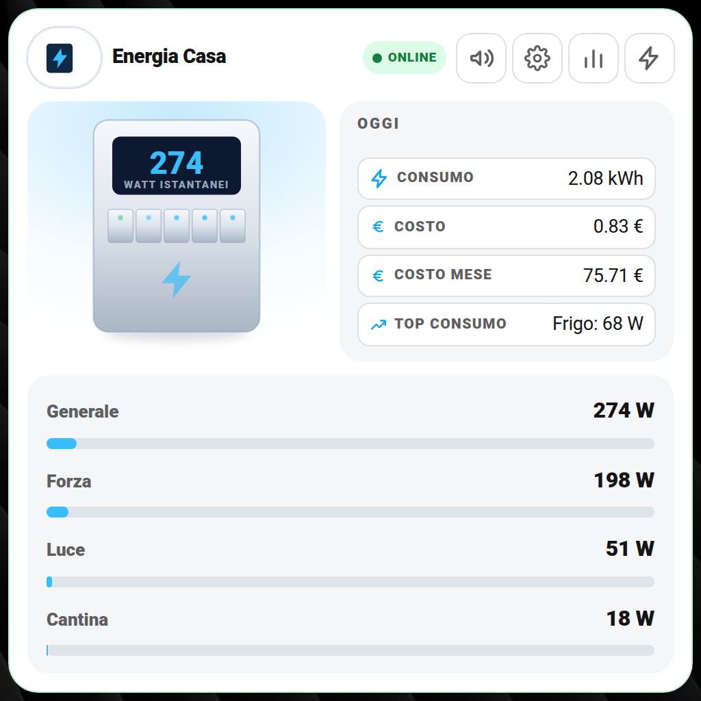
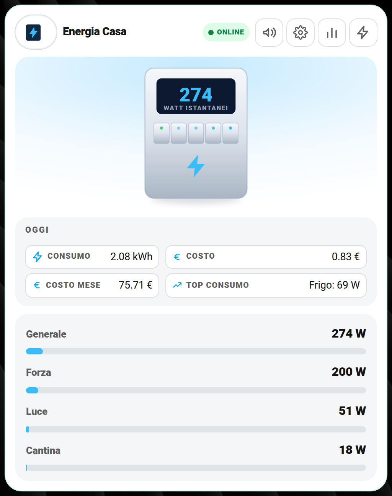
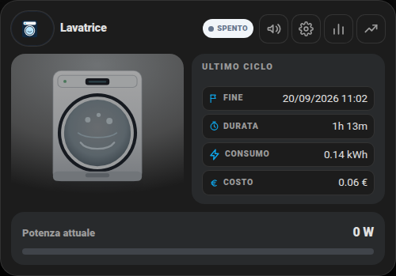
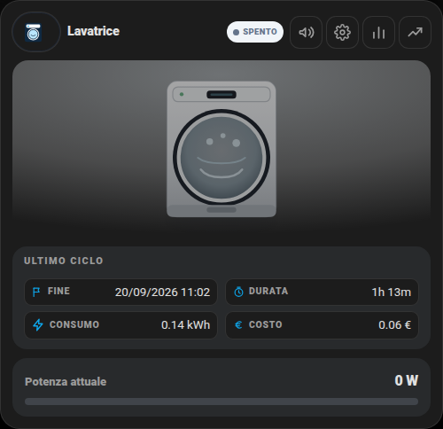

# smart-home-cards

Card Lovelace personalizzate per Home Assistant, pensate per essere "belle e complete" senza impilare 4-5 card diverse (HACS) una dentro l'altra. Ogni card è un unico file JavaScript, gira su qualunque dashboard (anche sul cellulare), ha un popup Impostazioni e uno Statistiche integrati, e un **editor visuale nativo** (niente YAML obbligatorio: "Aggiungi card" → cerchi il nome → compili i campi).

**Repository unico**: le 9 card (elettrodomestici, energia, FritzBox, server HA, NAS, Proxmox, UPS, raccolta differenziata, centro notifiche) sono tutte in **un solo file** (`smart-home-cards.js`) e documentate tutte qui sotto, nessun altro repository da installare a parte questo. *(In passato Energia Casa e Raccolta Differenziata avevano un repo a parte ciascuna — sono confluite qui per avere un unico posto da cui partire; quei due repo restano online per chi li aveva già installati, ma segnalano di passare a questo.)*

**Non serve programmare nulla**: si installa il file, si aggiunge la card alla dashboard, si scrivono i nomi delle proprie entità al posto di quelle di esempio. Tutte le istruzioni qui sotto sono scritte per chi non ha mai installato una card personalizzata prima.

> Autore: [Simonz82](https://github.com/Simonz82) — usate liberamente, adattate, migliorate. Se personalizzate qualcosa e vi sembra utile agli altri, una Pull Request è benvenuta.

## Indice

| Card | Cosa mostra | Serve per |
|---|---|---|
| [🧺 Elettrodomestici](docs/elettrodomestici.md) | Lavatrice, lavastoviglie, asciugatrice, forno, TV: stato, ciclo in corso, consumi, storico settimanale (anche senza YAML, vedi guida) | Qualsiasi elettrodomestico collegato a una presa/misuratore di potenza |
| [⚡ Energia Casa](docs/energia.md) | Consumo istantaneo, circuiti singoli, costi, confronto con periodo precedente | Un misuratore di potenza generale casa in Watt |
| [📶 FritzBox / Router](docs/fritzbox.md) | Stato connessione, banda impegnata, velocità, test di velocità | Router AVM FritzBox (integrazione ufficiale HA) |
| [🖥️ Server Home Assistant](docs/homeassistant-server.md) | CPU/RAM/disco del server, aggiornamenti, backup, riavvii programmati | Qualsiasi installazione Home Assistant (OS/Supervised/Container) |
| [💾 NAS Synology](docs/nas-synology.md) | CPU/RAM/volumi/dischi, stato sicurezza, consumo, riavvio/spegnimento | NAS Synology con integrazione DSM |
| [🖧 Proxmox](docs/proxmox.md) | Stato nodo, CPU/RAM/disco, VM/container attivi, salute SSD | Host Proxmox VE con un'integrazione che esponga questi sensori |
| [🔋 UPS](docs/ups.md) | Stato, carica batteria, carico, autonomia residua | Gruppo di continuità (es. tramite NUT/apcupsd) |
| [♻️ Raccolta Differenziata](docs/differenziata.md) | Rifiuto del giorno, giorno del ritiro, orario di esposizione, tipi di raccolta scritti a mano | Nessun hardware, solo un `input_text` |
| [🔔 Centro Notifiche](docs/centro-notifiche.md) | Volumi e finestra oraria degli annunci Alexa condivisi da tutte le altre card, in un'unica card di impostazioni | Il package `centro_notifiche_alexa.yaml` + integrazione Alexa Media Player |
| [📈 Grafici 24 h / 7 gg / 30 gg / da … a](docs/grafici.md) | Su ogni card un pulsante apre il grafico storico del dispositivo, adattato a PC e smartphone, con i picchi reali | Tutte le card |
| [🎛️ Layout classico / centrato](docs/layout.md) | Ogni card in due layout (foto a sinistra oppure foto centrale in alto), scelto da un menu nelle Impostazioni | Tutte le card |

Tutte le card condividono lo stesso motore di **notifiche personalizzate** (push + Alexa) — vedi [docs/notifiche-personalizzate.md](docs/notifiche-personalizzate.md) — e lo stesso mini-linguaggio per il popup Impostazioni — vedi [docs/settings-sections.md](docs/settings-sections.md).

## 📦 Installazione con HACS

Aggiungi questo repository come **repository personalizzato** in HACS (tre puntini in alto a destra → Repository personalizzati → `https://github.com/Simonz82/smart-home-cards`, categoria **Dashboard**) e installala da lì: aggiornamenti automatici, nessun file da ricopiare a mano. Dettagli: [docs/installazione.md](docs/installazione.md#0-con-hacs-se-preferisci-non-copiare-i-file-a-mano).

## Installazione rapida

Guida completa passo-passo: [docs/installazione.md](docs/installazione.md). In breve:

1. Scarica [`smart-home-cards.js`](smart-home-cards.js) e copialo in `/config/www/` sul tuo Home Assistant.
2. Impostazioni → Dashboard → (⋮ in alto a destra) → Risorse → Aggiungi risorsa → `/local/smart-home-cards.js` (tipo: Modulo JavaScript).
3. Ricarica la pagina (svuota la cache se serve).
4. Aggiungi una card, modalità YAML, incolla uno degli esempi nelle guide sopra, sostituisci le entità con le tue.
5. (Facoltativo) Per scegliere il layout dalle Impostazioni copia anche [`packages/layout_schede.yaml`](packages/layout_schede.yaml) (vedi [docs/layout.md](docs/layout.md)).
6. (Facoltativo, ma consigliato) Installa anche il mio package originale per quella card, in [`packages/`](packages/) — vedi il paragrafo "🚀 Metodo veloce" in cima a ogni guida. Sono i file **reali** che uso io, con solo poche righe da cambiare in cima (o da cercare e sostituire): niente da scrivere da zero.

Un solo file JS contiene tutte e 9 le card — installi una volta sola, poi usi quelle che ti servono.

## 🎛️ Due layout per ogni card

Ogni card si può mostrare in **classico** (foto a sinistra) o **centrato** (foto centrale in alto, informazioni su due colonne, poi le barre). La scelta è la **prima riga delle Impostazioni** della card: un menu a tendina, e la card cambia subito. Guida completa: **[docs/layout.md](docs/layout.md)**.

| Classico | Centrato |
|---|---|
|  |  |
|  |  |

## Cosa include, cosa devi adattare tu

- **Le immagini prodotto** (foto del router/NAS/UPS/logo Proxmox/HA mostrate nelle card) sono incluse in [`foto-pkg/`](foto-pkg/) — copiale insieme al file della card, vedi [docs/installazione.md](docs/installazione.md).
- **Le immagini dei rifiuti** (per la card Raccolta Differenziata) sono in [`rifiuti/`](rifiuti/) — vedi [docs/differenziata.md](docs/differenziata.md).
- **I package reali** (sensori, helper, automazioni di notifica/report/riavvio) sono in [`packages/`](packages/) — sono letteralmente quelli che uso io in produzione, con i dati personali tolti. Ogni guida spiega, nel paragrafo "🚀 Metodo veloce", esattamente quali righe cambiare per il tuo impianto.
- **Le entità** che ogni card e ogni package si aspettano dipendono comunque dal tuo impianto/integrazioni — ogni guida elenca esattamente quali servono e a cosa servono, sia per chi usa i miei package sia per chi preferisce costruire i propri da zero.

## Licenza

Nessuna restrizione: usale, modificale, ridistribuiscile. Se vuoi, cita la fonte.

---

## ☕ Vuoi darmi una mano?

Il contenuto di questa pagina è completamente gratuito e lo scopo non è certamente fare soldi. Se vuoi darmi una mano per le spese e il tempo perso, ecco alcuni modi:

| | |
|---|---|
|  | Offrimi un caffè su Ko-fi |
|  | Una donazione libera su PayPal |
|  | Fai i tuoi acquisti Amazon partendo da questo link |

**Canali Telegram:**

| | |
|---|---|
|  | Notizie dedicate a Home Assistant |
|  | Offerte sui prodotti di domotica |
