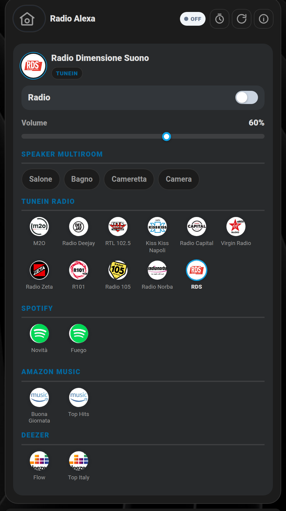

# 🔊 Card Alexa: Annuncio Testo (`shc-alexa-text-card`), Memo (`shc-alexa-memo-card`) e WebRadio (`shc-alexa-webradio-card`)

Tre card pensate per usare Alexa come "citofono/radio di casa", senza passare da automazioni scritte a mano ogni volta:

- **Alexa Annuncio Testo**: scrivi un messaggio al volo, scegli su quale speaker (o gruppo multiroom) farlo sentire, regoli il volume e lo riproduci con un tap. Pensata per gli annunci "adesso", non programmati.
- **Alexa Memo**: fino a **4 promemoria vocali indipendenti** (la card Memo 1 permette di sbloccarne altre, 2/3/4, in base a quanti ti servono), ognuno con un proprio testo, un intervallo di date + orario (oppure una singola data/ora se non ripetuto) e, opzionalmente, un **dispositivo Alexa dedicato**. Il campo **Persona** (opzionale) evita che un promemoria vada perso se all'orario previsto quella persona non è in casa: resta "in sospeso" e viene annunciato pochi minuti dopo il suo rientro.
- **Alexa WebRadio**: accendi una radio TuneIn o una playlist Spotify/Amazon Music/Deezer sugli speaker multiroom scelti, con controllo volume, sveglia programmata (a due orari, nei giorni scelti) e volume ridotto automatico allo spegnimento.

| Alexa Annuncio Testo | Alexa Memo |
|---|---|
|  |  |

Le prime due riusano lo stesso motore vocale condiviso di [`packages/centro_notifiche_alexa.yaml`](../packages/centro_notifiche_alexa.yaml) (script `script.notifica_vocale_alexa`), lo stesso usato dalle altre card di questa raccolta — vedi [notifiche-personalizzate.md](notifiche-personalizzate.md). **Alexa WebRadio è indipendente** da quel motore (riproduce stazioni/playlist, non messaggi vocali) — vedi la sua sezione più sotto per i prerequisiti specifici.

## Cosa ti serve prima di iniziare

- L'integrazione HACS **[Alexa Media Player](https://github.com/alandtse/alexa_media_player)** (non è nativa in Home Assistant) con almeno un dispositivo Alexa già collegato al tuo account Amazon.
- Il package condiviso [`packages/centro_notifiche_alexa.yaml`](../packages/centro_notifiche_alexa.yaml) — se lo hai già installato per un'altra card (es. Raccolta Differenziata) non serve ricopiarlo.

## 🚀 Metodo veloce: usa i miei package originali

- **Alexa Annuncio Testo** → [`packages/alexa_text.yaml`](../packages/alexa_text.yaml). In cima trovi il blocco `IMPOSTAZIONI PACKAGE`: sostituisci il servizio di notifica push (`mobile_app_il_tuo_telefono`) col tuo, e nella lista `list_alexa_speaker_multiroom_text` metti i **friendly name** dei tuoi `media_player.*` Alexa al posto dei miei.
- **Alexa Memo** → [`packages/memo_alexa.yaml`](../packages/memo_alexa.yaml). Nessun dato da cambiare in cima: crea solo gli `input_text`/`input_boolean`/`input_datetime`/`input_number` per i 4 memo e le automazioni che li annunciano. Nelle automazioni "Annuncio al rientro" sostituisci gli `entity_id` di esempio (`person.residente_1`, `person.residente_2`, …) con i tuoi `person.*` reali, oppure lascia solo quelli che ti servono.
- Copia entrambi i file dentro `/config/packages/` (richiede i [Packages](https://www.home-assistant.io/docs/configuration/packages/) attivi) insieme a `centro_notifiche_alexa.yaml`, poi riavvia Home Assistant.

## Configurazione minima — Alexa Annuncio Testo

```yaml
type: custom:shc-alexa-text-card
name: Alexa
speaker_select_entity: input_select.list_alexa_speaker_multiroom_text
add_script: script.add_alexa_text
remove_script: script.remove_alexa_text
text_entity: input_text.alexa_text
volume_entity: input_number.volume_alexa_text
play_script: script.alexa_text_normale
group_entity: group.multiroom_alexa_text
```

### Campo per campo

| Campo | Obbligatorio | Descrizione |
|---|---|---|
| `speaker_select_entity` | **Sì** | `input_select` con l'elenco dei friendly name degli speaker Alexa disponibili |
| `add_script` / `remove_script` | **Sì** | Script che aggiungono/rimuovono lo speaker selezionato dal gruppo multiroom |
| `text_entity` | **Sì** | `input_text` col messaggio da annunciare |
| `volume_entity` | **Sì** | `input_number` (0–1) col volume del gruppo |
| `play_script` | **Sì** | Script che avvia l'annuncio TTS sul gruppo |
| `group_entity` | **Sì** | `group` multiroom su cui viene riprodotto il messaggio (mostrato in card come elenco "In riproduzione su") |
| `name` | No | Titolo card (default `"Alexa"`) |

## Configurazione minima — Alexa Memo (una per slot, 1 a 4)

```yaml
type: custom:shc-alexa-memo-card
name: Memo 1
active_entity: input_boolean.memo_alexa_1_attivo
text_entity: input_text.memo_alexa_1_testo
repeat_entity: input_boolean.memo_alexa_1_ripetizione
date_start_entity: input_datetime.memo_alexa_1_data_inizio
date_end_entity: input_datetime.memo_alexa_1_data_fine
time_entity: input_datetime.memo_alexa_1_orario
once_datetime_entity: input_datetime.memo_alexa_1_data_singola
person_entity: input_text.memo_alexa_1_persona
pending_entity: input_boolean.memo_alexa_1_pending
retry_delay_entity: input_number.memo_alexa_1_ritardo_rientro
devices_entity: input_text.memo_alexa_1_dispositivi
slot_count_entity: input_number.memo_alexa_slot_attivi
```

Le card Memo 2/3/4 sono identiche (cambia solo il numero nell'`entity_id`) e in genere si nascondono da sole in dashboard finché non servono, con una `visibility` sul valore di `input_number.memo_alexa_slot_attivi`:

```yaml
visibility:
  - condition: numeric_state
    entity: input_number.memo_alexa_slot_attivi
    above: 1   # 2 per Memo 3, 3 per Memo 4
```

### Campo per campo

| Campo | Obbligatorio | Descrizione |
|---|---|---|
| `active_entity` | **Sì** | `input_boolean` che attiva/disattiva il memo |
| `text_entity` | **Sì** | `input_text` col messaggio da annunciare |
| `repeat_entity` | **Sì** | `input_boolean`: acceso = ripete ogni giorno nell'intervallo date, spento = una tantum su `once_datetime_entity` |
| `date_start_entity` / `date_end_entity` | **Sì** | `input_datetime` (solo data) con l'intervallo in cui il memo è attivo, se ripetuto |
| `time_entity` | **Sì** | `input_datetime` (solo ora) con l'orario dell'annuncio giornaliero |
| `once_datetime_entity` | **Sì** | `input_datetime` (data+ora) usato quando il memo **non** è ripetuto |
| `person_entity` | **Sì** | `input_text` col `person.*` da controllare (vuoto = annuncia comunque all'orario, nessun controllo presenza) |
| `pending_entity` | **Sì** | `input_boolean` interno: resta acceso se l'annuncio è "in sospeso" in attesa del rientro |
| `retry_delay_entity` | **Sì** | `input_number` con i minuti di attesa dopo il rientro prima di riprovare |
| `devices_entity` | **Sì** | `input_text` con gli `entity_id` `media_player.*` scelti per la riproduzione (separati da virgola, vuoto = dispositivo Alexa predefinito) — nell'editor visuale è una selezione a chip |
| `slot_count_entity` | No (solo su Memo 1) | `input_number` che mostra sulla card 1 uno stepper "Altri memo attivi" per sbloccare Memo 3/4 |
| `name` | No | Titolo card (default `"Alexa"`) |

Il pulsante ℹ️ sulla card Memo apre un piccolo popup che spiega il funzionamento (utile per chi la usa, non solo per chi la configura):


## 📻 Alexa WebRadio



Stazioni TuneIn e playlist Spotify/Amazon Music/Deezer raggruppate in griglie con logo piccolo (non a schermo intero), tema chiaro/scuro. Tocca una stazione per selezionarla, i chip degli speaker per aggiungerli/rimuoverli dal gruppo multiroom (quello evidenziato in blu è già acceso), il cursore per il volume. I due pulsanti in alto (orologio e "restart") aprono le impostazioni di **Sveglia** e **Volume ridotto automatico** senza uscire dalla card.

### Cosa ti serve

- L'integrazione HACS **[Alexa Media Player](https://github.com/alandtse/alexa_media_player)**, con almeno un dispositivo Alexa già collegato al tuo account Amazon. **Non serve** `centro_notifiche_alexa.yaml` (questa card non lo usa).
- Un abbonamento/servizio già collegato ad Alexa per ciascuna fonte che vuoi usare (TuneIn è gratuito; Spotify/Amazon Music/Deezer richiedono l'account collegato in app Alexa).

### 🚀 Metodo veloce: usa il mio package originale

[`packages/alexa_webradio.yaml`](../packages/alexa_webradio.yaml) — nessun dato personale da cambiare in cima. Nella sezione `input_select: list_alexa_speaker_multiroom` sostituisci i **friendly name** dei 4 speaker Alexa con i tuoi (la card ne mostra 4 come chip fissi: se ne hai un numero diverso, aggiungi/togli le righe corrispondenti nell'array `WR_SPEAKERS` dentro `smart-home-cards.js`, cercalo con Ctrl+F). L'elenco delle 17 stazioni/playlist (array `WR_STATION_GROUPS`, stesso file) è il mio: modificalo liberamente per il tuo elenco Alexa — nome stazione esattamente come compare nell'app Alexa, e un'immagine quadrata a tua scelta in `/config/www/loghi_radio_alexa/4_4/`.

Copia il file dentro `/config/packages/` (richiede i [Packages](https://www.home-assistant.io/docs/configuration/packages/) attivi), copia le immagini delle stazioni in `/config/www/loghi_radio_alexa/4_4/`, poi riavvia Home Assistant.

### Configurazione minima

```yaml
type: custom:shc-alexa-webradio-card
name: Radio Alexa
power_entity: input_boolean.web_radio_alexa
station_select_entity: input_select.stazioni_radio_alexa
station_sensor_entity: sensor.template_radio_alexa
volume_entity: input_number.volume_radio_alexa
group_entity: group.multiroom_alexa
speaker_list_entity: input_select.list_alexa_speaker_multiroom
alarm_entity: input_boolean.sveglia_alexa
alarm_on_entity: input_datetime.ora_sveglia_alexa_on
alarm_off_entity: input_datetime.ora_sveglia_alexa_off
volume_off_automation: automation.radio_off_volume_alexa
volume_off_entity: input_number.volume_radio_off_alexa
```

### Campo per campo

| Campo | Obbligatorio | Descrizione |
|---|---|---|
| `power_entity` | **Sì** | `input_boolean` che accende/spegne la radio sul gruppo multiroom |
| `station_select_entity` | **Sì** | `input_select` con l'elenco delle stazioni/playlist (i separatori `-- ... --` sono ignorati dalla card) |
| `station_sensor_entity` | **Sì** | Sensore template con attributi `select` (nome per Alexa), `servizi` (TUNEIN/SPOTIFY/AMAZON_MUSIC/DEEZER) e `entity_picture` (logo) — vedi il package |
| `volume_entity` | **Sì** | `input_number` (0–1) col volume del gruppo |
| `group_entity` | **Sì** | `group` multiroom su cui viene riprodotta la radio |
| `speaker_list_entity` | **Sì** | `input_select` usato dai chip degli speaker per selezionare quale aggiungere/rimuovere dal gruppo |
| `alarm_entity` / `alarm_on_entity` / `alarm_off_entity` | No | Sveglia: attiva/disattiva + i due orari (i giorni della settimana sono i 7 `input_boolean.alexa_sveglia_<giorno>` del package, fissi) |
| `volume_off_automation` / `volume_off_entity` | No | Automazione che, allo spegnimento, abbassa il volume del gruppo al valore scelto |
| `name` | No | Titolo card (default `"Radio Alexa"`) |

## 🖊️ Editor visuale (senza YAML)

Non serve scrivere configurazione a mano: "Aggiungi card" → cerca **"Alexa Annuncio Testo"**, **"Alexa Memo"** o **"Alexa WebRadio"** → compili i campi, ogni entità si cerca per nome con anteprima. Lo stesso editor si apre anche per modificare una card già aggiunta (pulsante "⋮" sulla card in modalità modifica → "Edit"). Sulla card Memo, il campo Dispositivi si compila con **chip a selezione multipla** (una per ogni `media_player.*` Alexa rilevato) invece di scrivere gli `entity_id` a mano.

| Editor Alexa Annuncio Testo | Editor Alexa Memo |
|---|---|
|  |  |
