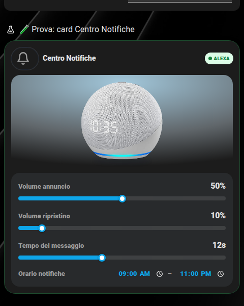
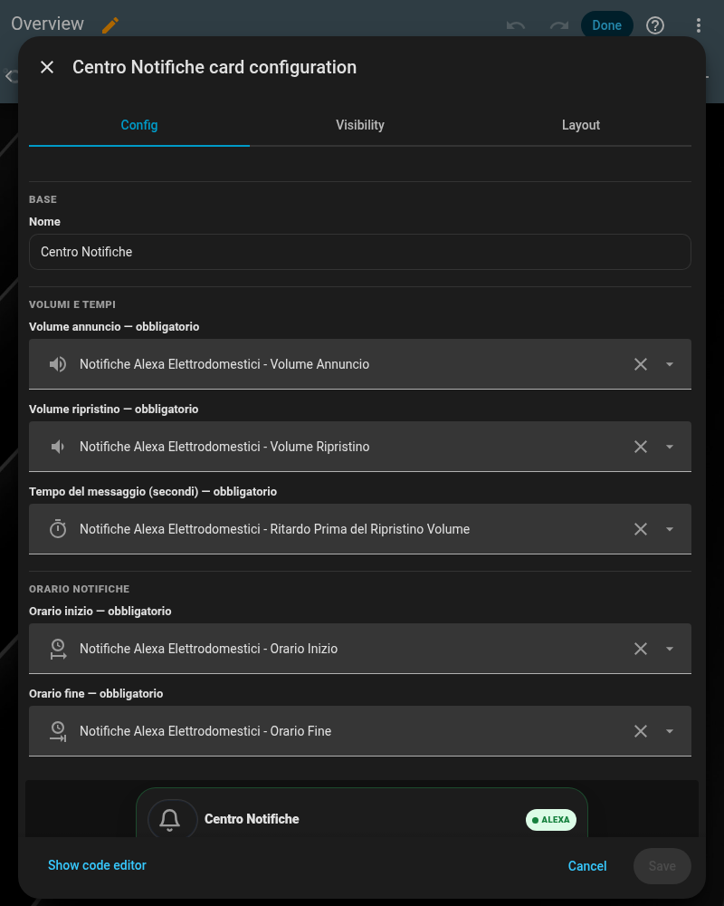

# 🔔 Card Centro Notifiche (`shc-notif-center-card`)

Un solo posto da cui regolare le impostazioni condivise degli annunci vocali Alexa usati da tutte le altre card (elettrodomestici, raccolta differenziata, energia...): volume dell'annuncio, volume di ripristino dopo l'annuncio, quanto dura il messaggio prima di ripristinare il volume, e la finestra oraria in cui è permesso annunciare. A differenza delle altre card, questa **non ha un layout classico/centrato**: è pensata per stare da sola in una pagina di impostazioni, un solo layout fisso.

| Chiaro |
|---|
|  |

## Cosa ti serve prima di iniziare

Il motore condiviso di annunci vocali — vedi [`packages/centro_notifiche_alexa.yaml`](../packages/centro_notifiche_alexa.yaml) — che crea da solo i 5 helper che questa card mostra e modifica. Serve anche l'integrazione HACS **[Alexa Media Player](https://github.com/alandtse/alexa_media_player)** con un dispositivo Alexa collegato (dettagli in [notifiche-personalizzate.md](notifiche-personalizzate.md)); senza, gli helper esistono comunque ma non c'è nessun dispositivo che li usi davvero.

## 🚀 Metodo veloce: usa il mio package originale

Copia [`packages/centro_notifiche_alexa.yaml`](../packages/centro_notifiche_alexa.yaml) dentro `/config/packages/` (richiede i [Packages](https://www.home-assistant.io/docs/configuration/packages/) attivi). Crea da solo:

- `input_number.volume_alexa_notifica_elettrodomestici` — Volume annuncio
- `input_number.volume_alexa_ripristino_elettrodomestici` — Volume ripristino
- `input_number.ritardo_dopo_notifica_alexa_elettrodomestici` — Tempo del messaggio (secondi prima di ripristinare il volume)
- `input_datetime.orario_inizio_notifiche_alexa` — Orario inizio finestra notifiche
- `input_datetime.orario_fine_notifiche_alexa` — Orario fine finestra notifiche
- `script.notifica_vocale_alexa` — lo script condiviso che ogni altra card chiama per annunciare (vedi [notifiche-personalizzate.md](notifiche-personalizzate.md))

Riavvia Home Assistant, poi aggiungi la card con la configurazione più sotto — punta semplicemente ai 5 helper appena creati.

## 🖊️ Editor visuale (senza YAML)

Non serve scrivere configurazione a mano: "Aggiungi card" → cerca **"Centro Notifiche"** → compila i 5 campi, ogni entità si cerca per nome con anteprima. Lo stesso editor si apre anche per modificare una card già aggiunta (pulsante "⋮" sulla card in modalità modifica → "Edit").



## Configurazione minima

```yaml
type: custom:shc-notif-center-card
name: Centro Notifiche
volume_notifica_entity: input_number.volume_alexa_notifica_elettrodomestici
volume_ripristino_entity: input_number.volume_alexa_ripristino_elettrodomestici
tempo_messaggio_entity: input_number.ritardo_dopo_notifica_alexa_elettrodomestici
orario_inizio_entity: input_datetime.orario_inizio_notifiche_alexa
orario_fine_entity: input_datetime.orario_fine_notifiche_alexa
```

Tutti e 5 i campi entità sono **obbligatori** — senza uno di questi la card non si carica (a differenza delle altre card, qui non ha senso mostrare la card a metà: sono impostazioni, non uno stato).

## Campo per campo

| Campo | Obbligatorio | Descrizione |
|---|---|---|
| `name` | No | Titolo card (default `"Centro Notifiche"`) |
| `volume_notifica_entity` | **Sì** | `input_number` (0–1) con il volume dell'annuncio, mostrato come slider 0–100% |
| `volume_ripristino_entity` | **Sì** | `input_number` (0–1) con il volume a cui torna il dispositivo dopo l'annuncio |
| `tempo_messaggio_entity` | **Sì** | `input_number` (secondi) con quanto aspettare prima di ripristinare il volume |
| `orario_inizio_entity` | **Sì** | `input_datetime` (solo ora) con l'inizio della finestra in cui è permesso annunciare |
| `orario_fine_entity` | **Sì** | `input_datetime` (solo ora) con la fine della finestra |

Trascina gli slider o tocca gli orari direttamente sulla card: ogni modifica scrive subito sull'helper corrispondente, nessun popup Impostazioni da aprire.

**Se la card mostra un avviso "Manca la configurazione di..."** invece dei controlli, uno o più campi entità si sono svuotati (capita facilmente se tocchi per sbaglio la "✕" di un campo nell'editor mentre riorganizzi la dashboard) — apri "Modifica" (⋮ sulla card, in modalità modifica dashboard) e ricompila i campi mancanti. La card non sparisce più con l'errore generico di Home Assistant, dice sempre esattamente cosa manca.
