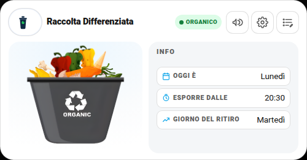
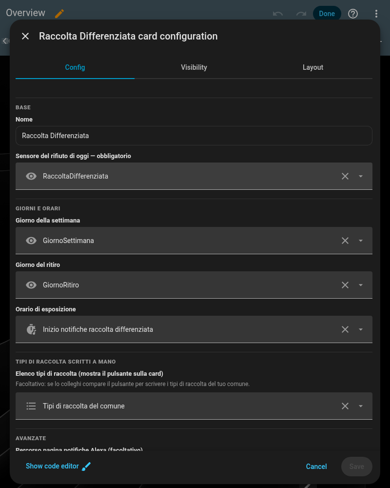
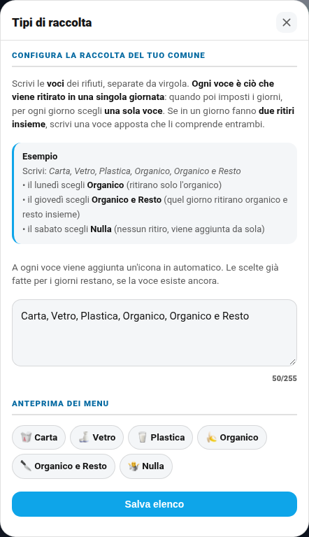
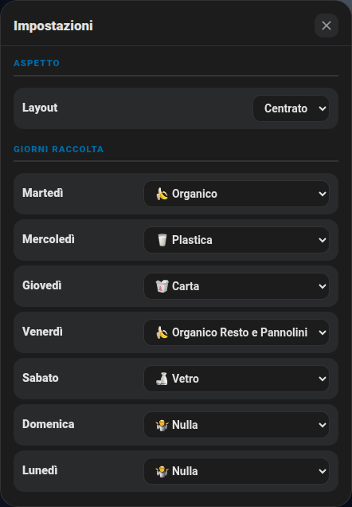

# ♻️ Card Raccolta Differenziata (`shc-garbage-card`)

Mostra un'immagine diversa in base al rifiuto da buttare **oggi**, il giorno della settimana e il giorno del ritiro. Un promemoria (notifica push + annuncio vocale su Alexa) avvisa finché non lo disattivi. I **tipi di raccolta si scrivono a mano dalla card**, non sono fissi: ogni comune raccoglie cose diverse.

Progetto storico ripreso da una card più vecchia condivisa tempo fa (con basi di Saverio Gravagnola e Agostino Pitasi — altri spunti su [domoticamente.it](http://domoticamente.it) e su [scheccia1/hagarbage](https://github.com/scheccia1/hagarbage)), riscritto da zero con la stessa grammatica visiva delle altre card di questa raccolta.

| Chiaro |
|---|
|  |

## Cosa ti serve prima di iniziare

Nulla di hardware: basta un `input_text` (per l'elenco tipi di raccolta) e qualche automazione, tutto già pronto nel package qui sotto. Il promemoria vocale è **opzionale** (senza, restano comunque l'immagine sulla card e la notifica push) e usa lo stesso motore condiviso di Alexa delle altre card: se lo vuoi, serve l'integrazione HACS **[Alexa Media Player](https://github.com/alandtse/alexa_media_player)** (non è nativa in Home Assistant) e un dispositivo Alexa già collegato al tuo account Amazon — dettagli in [notifiche-personalizzate.md](notifiche-personalizzate.md).

## 🚀 Metodo veloce: usa il mio package originale

Il package completo — automazioni giorno/ritiro, promemoria orario, tipi di raccolta scritti a mano — è in [`packages/differenziata.yaml`](../packages/differenziata.yaml). **Dipende** da [`packages/centro_notifiche_alexa.yaml`](../packages/centro_notifiche_alexa.yaml) (script condiviso per gli annunci vocali, usato anche da altre card): copia **entrambi**, altrimenti l'annuncio Alexa non funziona (il resto della card funziona comunque).

**Istruzioni:**

1. Copia i due file dentro `/config/packages/` (richiede i [Packages](https://www.home-assistant.io/docs/configuration/packages/) attivi).
2. In cima a `differenziata.yaml` trovi il blocco **`IMPOSTAZIONI DA MODIFICARE`**: sostituisci i dispositivi per la notifica push (`mobile_app_pippo` ecc.) e, se usi Alexa, i tuoi `media_player.*`.
3. Copia la cartella [`rifiuti/`](../rifiuti/) dentro `/config/www/rifiuti/`: sono le 6 immagini di default (Carta, Vetro, Plastica, Organico, Organico e Resto, Nulla) — puoi sostituirle con le tue, stessi nomi file.
4. Riavvia Home Assistant.
5. Aggiungi la card con la configurazione più sotto.

## Configurazione minima

```yaml
type: custom:shc-garbage-card
name: Raccolta Differenziata
entity: sensor.rifiuto_di_oggi
state_images:
  Carta: /local/rifiuti/carta.png
  Vetro: /local/rifiuti/vetro.png
  Plastica: /local/rifiuti/plastica.png
  Organico: /local/rifiuti/organico.png
  "Organico e Resto": /local/rifiuti/organicoeresto.png
  Nulla: /local/rifiuti/nulla.png
```

## 🖊️ Editor visuale (senza YAML)

Non serve scrivere configurazione a mano: "Aggiungi card" → cerca **"Raccolta Differenziata"** → compila i campi, ogni entità si cerca per nome con anteprima. Lo stesso editor si apre anche per modificare una card già aggiunta (pulsante "⋮" sulla card in modalità modifica → "Edit").



## Campo per campo

| Campo | Obbligatorio | Default | Descrizione |
|---|---|---|---|
| `entity` | **Sì** | — | Sensore testuale col rifiuto di **oggi** (uno dei valori usati come chiave in `state_images`) |
| `state_images` | No | `{}` | Mappa `"nome rifiuto": "url immagine"` — le chiavi devono corrispondere agli stati di `entity`. Senza immagine per uno stato, si usa quella di `Nulla` |
| `name` | No | `"Raccolta Differenziata"` | Titolo card |
| `weekday_entity` | No | — | `sensor` col giorno della settimana di oggi, mostrato nella riga "Oggi è" |
| `pickup_day_entity` | No | — | `sensor` col giorno del prossimo ritiro |
| `expose_time_entity` | No | — | `input_datetime`/`sensor` con l'orario in cui esporre i bidoni |
| `types_entity` | No | — | `input_text` con l'elenco dei tipi di raccolta scritti a mano (v. sotto) — se la colleghi compare il pulsante dedicato |
| `layout_entity` | No | — | Menu classico/centrato, vedi [layout.md](layout.md) |
| `notif_center_path` | No | — | Percorso di una tua pagina Lovelace condivisa (es. `/lovelace/centronotifiche`) dove centralizzi le impostazioni Alexa di più card. Senza questo campo il pulsante megafono resta **nascosto** |
| `actions` | No | `[]` | Pulsanti extra con conferma, stesso formato delle altre card — vedi [fritzbox.md](fritzbox.md#actions--pulsanti-con-conferma) |
| `settings_sections` | No | `[]` | Vedi [settings-sections.md](settings-sections.md) |

## 🗂️ Configura i tipi di raccolta del tuo comune

Ogni comune raccoglie cose diverse: c'è chi ha "Umido" e "Secco", chi "Organico e Resto", chi anche "Ingombranti" o "Pile". Per questo l'elenco **non è fisso**: lo scrivi tu, direttamente dalla card, con il pulsante **Tipi di raccolta** (compare solo se colleghi `types_entity`).

| Chiaro | Scuro |
|---|---|
|  |  |

**Come si usa**

1. Tocca **Tipi di raccolta** e scrivi le voci separate da **virgola** (vanno bene anche `;` o un a capo).
2. Sotto vedi subito l'**anteprima** dei menu che verranno creati. Premi **Salva elenco**.
3. Da quel momento i 7 menu dei giorni (nelle **Impostazioni**, l'ingranaggio) contengono le tue voci.

**Come ragionare (importante)**

> **Ogni voce è ciò che viene ritirato in una singola giornata.** Quando poi imposti i giorni, per ogni giorno scegli **una sola voce**. Se in un giorno fanno **due ritiri insieme**, scrivi una **voce apposta** che li comprende entrambi.

**Esempio**

Scrivi: `Carta, Vetro, Plastica, Organico, Organico e Resto`

- il **lunedì** scegli **Organico** → quel giorno ritirano solo l'organico;
- il **giovedì** scegli **Organico e Resto** → quel giorno ritirano organico e resto insieme (due ritiri, una voce);
- il **sabato** scegli **Nulla** → nessun ritiro (aggiunta da sola, non serve scriverla).

## 🎛️ Layout classico o centrato

Come tutte le altre card, si sceglie dalla prima riga **Layout** delle Impostazioni: vedi [layout.md](layout.md).

## 🖼️ Tutte le schermate

Tutti i popup della card, con i dati sensibili oscurati.

**Impostazioni (ingranaggio)**

| Chiaro | Scuro |
|---|---|
|  |  |
