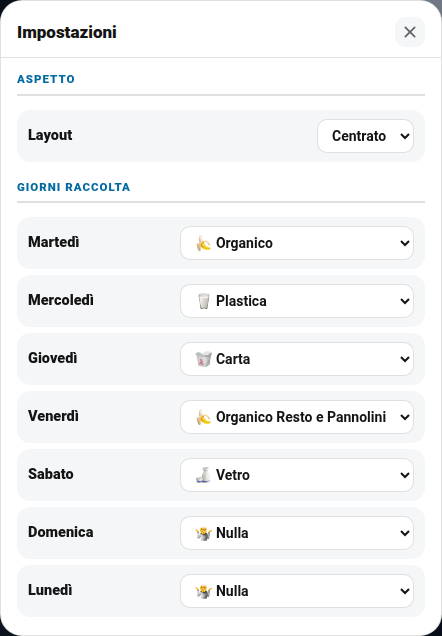
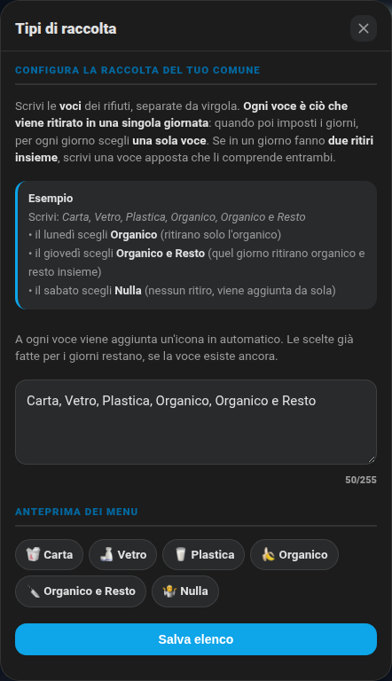
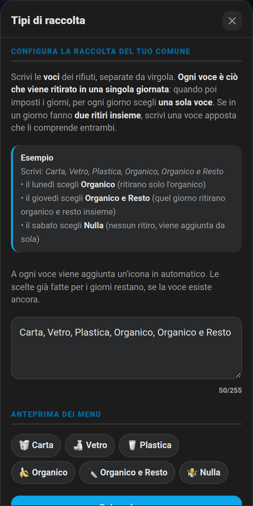
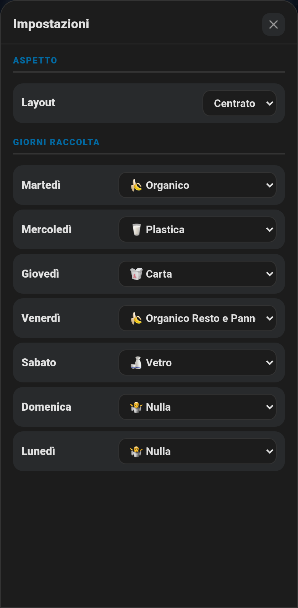

# ♻️ Raccolta differenziata (`dm-garbage-card`)

Card e package che gestiscono i giorni della raccolta differenziata: mostra l'immagine del rifiuto che va buttato **oggi**, il giorno del ritiro, l'orario in cui esporre i bidoni e manda un promemoria (notifica push + annuncio su Alexa) finché non lo disattivi.

> La guida completa, le immagini dei rifiuti e il package si trovano anche nel repository dedicato **[ha_garbage](https://github.com/Simonz82/ha_garbage)**.

| Layout classico | Layout centrato |
|---|---|
|  |  |
|  |  |

I tre pulsanti in alto a destra: **megafono** (opzionale, porta alla tua pagina notifiche Alexa), **ingranaggio** (Impostazioni) e **Tipi di raccolta**.

## ⚙️ Impostazioni

L'ingranaggio apre una finestra nativa: la prima riga è **Layout** (classico / centrato), poi i **giorni della raccolta**: per ogni giorno scegli cosa si ritira.

| Chiaro | Scuro |
|---|---|
|  |  |

> I menu sono "spostati" di un giorno, come nel package originale: la riga **Martedì** dice cosa si ritira **martedì** e viene mostrata la sera prima (lunedì), quando si espone il bidone.

## 🗂️ Configura i tipi di raccolta del tuo comune

Ogni comune raccoglie cose diverse: c'è chi ha "Umido" e "Secco", chi "Organico e Resto", chi anche "Ingombranti" o "Pile". Per questo l'elenco dei rifiuti **non è fisso**: lo scrivi tu, direttamente dalla card, con il pulsante **Tipi di raccolta** (l'ultimo a destra, dopo l'ingranaggio).

| Chiaro | Scuro |
|---|---|
|  |  |

**Come si usa**

1. Tocca **Tipi di raccolta** e scrivi le voci separate da **virgola** (vanno bene anche `;` o un a capo).
2. Sotto vedi subito l'**anteprima** dei menu che verranno creati. Premi **Salva elenco**.
3. Da quel momento i 7 menu dei giorni (nelle **Impostazioni**, l'ingranaggio) contengono le tue voci.

**Come ragionare (importante)**

> **Ogni voce è ciò che viene ritirato in una singola giornata.** Quando poi imposti i giorni, per ogni giorno scegli **una sola voce**. Se in un giorno fanno **due ritiri insieme**, scrivi una **voce apposta** che li comprende entrambi.

**Esempio**

Scrivi: `Carta, Vetro, Plastica, Organico, Organico e Resto`

- il **lunedì** scegli **Organico** → quel giorno ritirano solo l'organico;
- il **giovedì** scegli **Organico e Resto** → quel giorno ritirano organico e resto insieme (due ritiri, una voce);
- il **sabato** scegli **Nulla** → nessun ritiro. **"Nulla" viene aggiunta da sola**, non devi scriverla.

**Cosa succede da solo**

- A ogni voce viene aggiunta un'**icona** (carta 🥡, vetro 🍶, plastica 🥛, organico 🍌, indifferenziato ♻, ingombranti 🛋, pile 🔋, sfalci 🌿 …; se la parola non è nota viene messo un cestino 🗑). Se la voce comincia già con un'emoji, viene lasciata com'è.
- **Le scelte già fatte per i giorni restano**, se la voce esiste ancora nel nuovo elenco (altrimenti quel giorno passa a "Nulla").
- La scelta di ogni giorno viene **salvata al sicuro** (`input_text.raccolta_giorno_lun` … `dom`): sopravvive ai riavvii di Home Assistant.
- L'immagine della card: per i tipi che hanno una foto (`state_images`) si vede quella; per un tipo **senza foto** compare la sua **icona in grande**.
- Notifica push e annuncio vocale usano la stessa voce ("Oggi si butta *Organico e Resto*").

**Cosa serve**: il package [`packages/differenziata.yaml`](../packages/differenziata.yaml) (crea `input_text.raccolta_tipi_elenco`, i 7 `input_text` di appoggio e le due automazioni) e, nella configurazione della card, una riga in più:

```yaml
types_entity: input_text.raccolta_tipi_elenco
```

Senza `types_entity` il pulsante non compare e i menu restano quelli del package (Indifferenziato, Organico, Organico e Resto, Carta, Vetro, Plastica, Nulla). Se `raccolta_tipi_elenco` è vuoto si usa quell'elenco di esempio.

**Su smartphone**

| Tipi di raccolta | Impostazioni giorni |
|---|---|
|  |  |


## Installazione

1. Copia `smart-home-cards.js` come per le altre card (vedi [installazione](installazione.md)).
2. Copia in `/config/packages/` i file [`differenziata.yaml`](../packages/differenziata.yaml) e [`centro_notifiche_alexa.yaml`](../packages/centro_notifiche_alexa.yaml) (il secondo contiene lo script degli annunci vocali) e, se vuoi il menu del layout, [`layout_schede.yaml`](../packages/layout_schede.yaml).
3. Copia le immagini dei rifiuti (`www/rifiuti/`) dal repository [ha_garbage](https://github.com/Simonz82/ha_garbage/tree/main/www/rifiuti) in `/config/www/rifiuti/`.
4. Configura la card:

```yaml
type: custom:dm-garbage-card
entity: sensor.raccoltadifferenziata
weekday_entity: sensor.giornosettimana
pickup_day_entity: sensor.giornoritiro
expose_time_entity: input_datetime.raccolta_differenziata_notifiche_start_time
layout_entity: input_select.layout_garbage
types_entity: input_text.raccolta_tipi_elenco     # pulsante "Tipi di raccolta"
state_images:
  Carta: /local/rifiuti/carta.png
  Vetro: /local/rifiuti/vetro.png
  Plastica: /local/rifiuti/plastica.png
  Organico: /local/rifiuti/organico.png
  "Organico e Resto": /local/rifiuti/organicoeresto.png
  Nulla: /local/rifiuti/nulla.png
settings_sections:
  - title: Aspetto
    rows:
      - {label: Layout, entity: input_select.layout_garbage}
  - title: Giorni raccolta
    rows:
      - {label: Martedì, entity: input_select.raccolta_differenziata_lun}
      - {label: Mercoledì, entity: input_select.raccolta_differenziata_mar}
      - {label: Giovedì, entity: input_select.raccolta_differenziata_mer}
      - {label: Venerdì, entity: input_select.raccolta_differenziata_gio}
      - {label: Sabato, entity: input_select.raccolta_differenziata_ven}
      - {label: Domenica, entity: input_select.raccolta_differenziata_sab}
      - {label: Lunedì, entity: input_select.raccolta_differenziata_dom}
```

In `differenziata.yaml` cambia solo le righe in cima `Device per notifica push 1/2` con le tue entità `mobile_app_...`.
