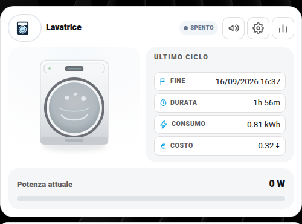
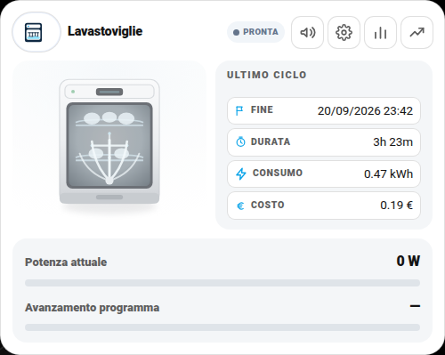
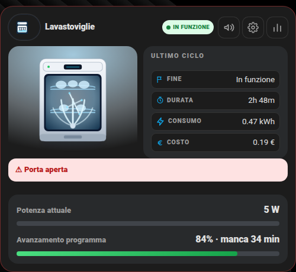
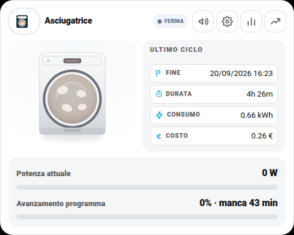
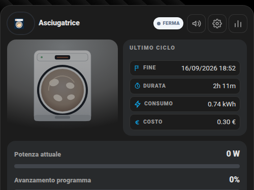
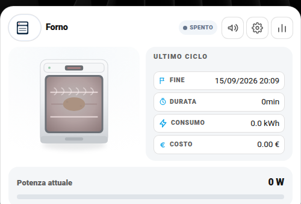
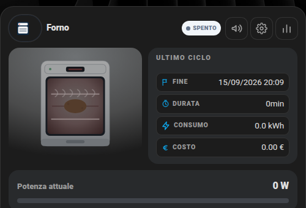
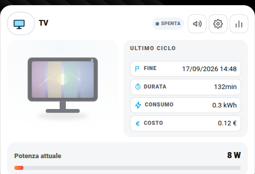
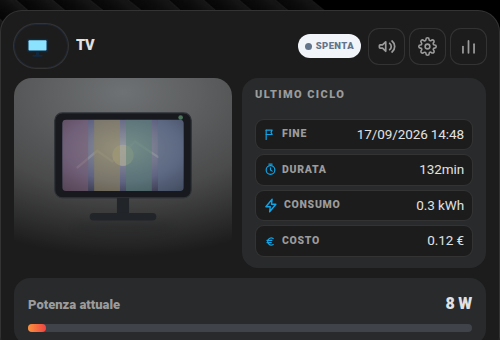

# 🧺 Card Elettrodomestici (`dm-appliance-clone-card`)

Una card, sei "disegni" diversi: lavastoviglie, lavatrice, asciugatrice, forno, TV, scaldabagno. Cambia solo il campo `artwork` — tutto il resto del comportamento è identico.

| | Chiaro | Scuro |
|---|---|---|
| **Lavatrice** |  |  |
| **Lavastoviglie** |  |  |
| **Asciugatrice** |  |  |
| **Forno** |  |  |
| **TV** |  |  |

## Cosa ti serve prima di iniziare

Un modo per misurare quanti **Watt** sta assorbendo l'elettrodomestico in questo momento — cioè una presa intelligente con misurazione di potenza (Shelly Plug S, Sonoff S31/POWR3, TP-Link Kasa KP115, ecc.) collegata via qualsiasi integrazione HA, oppure un misuratore di potenza per elettrodomestici già cablati (es. un contatore su una linea dedicata). Da lì in poi Home Assistant deve esporre un `sensor` in Watt: quello è il `power_entity`, l'unico campo obbligatorio.

> Nella mia installazione uso prese **SONOFF S60TPF** (misurano sia Watt istantanei che kWh cumulati, integrate via eWeLink/Sonoff LAN o Zigbee a seconda del modello) — se vuoi partire da un prodotto concreto invece di scegliere alla cieca, è quello che uso io su tutti gli elettrodomestici di questa guida.

## 🚀 Metodo veloce: usa i miei package originali

Invece di costruire tutto da zero seguendo il resto della guida, puoi partire direttamente dal **package completo che uso io** — stessa logica, stessi helper, stesse automazioni di notifica (push/Alexa/Telegram), già pronto, con solo poche righe da cambiare in cima al file:

| Elettrodomestico | File |
|---|---|
| Lavatrice | [`packages/centro_controllo_lavatrice.yaml`](../packages/centro_controllo_lavatrice.yaml) |
| Lavastoviglie | [`packages/centro_controllo_lavastoviglie.yaml`](../packages/centro_controllo_lavastoviglie.yaml) |
| Asciugatrice | [`packages/centro_controllo_asciugatrice.yaml`](../packages/centro_controllo_asciugatrice.yaml) |
| Forno | [`packages/centro_controllo_forno.yaml`](../packages/centro_controllo_forno.yaml) |
| TV | [`packages/centro_controllo_tv.yaml`](../packages/centro_controllo_tv.yaml) |

**Istruzioni:**

1. Copia il file dell'elettrodomestico che ti interessa dentro `/config/packages/` (richiede i [Packages](https://www.home-assistant.io/docs/configuration/packages/) attivi — una tantum, `homeassistant: packages: !include_dir_named packages` in `configuration.yaml`).
2. Apri il file: in cima trovi il blocco **`IMPOSTAZIONI PACKAGE`** (poche righe). È l'unica parte da modificare:
   - `Sensore Consumo Elettrodomestici` → il TUO sensore di potenza in Watt (es. `sensor.la_tua_lavatrice_power`)
   - `Switch Power Elettrodomestici` → uno switch reale solo se vuoi poter togliere corrente da remoto, altrimenti lascialo com'è
   - `Lista mediaplayer alexa` → i TUOI dispositivi Alexa (elimina la riga se non li usi)
   - `Device per notifica push` → i TUOI `notify.mobile_app_xxx` (uno o più)
3. Cerca `xxx` nel file (Ctrl+F): se qualche riga non è già stata compilata, è lì che manca un tuo valore.
4. Riavvia Home Assistant (i package si caricano solo al riavvio).
5. Aggiungi la card alla dashboard con la configurazione minima o completa più sotto in questa guida.

**Hai più di un elettrodomestico dello stesso tipo?** Duplica il file, rinominalo, e nel nuovo file sostituisci ogni ricorrenza del numero finale (es. `_1` → `_6`) con Trova e sostituisci — tutti i nomi interni (sensori, helper, automazioni) sono numerati così apposta, per evitare collisioni tra un elettrodomestico e l'altro.

Il resto di questa guida spiega **come funziona** ogni campo, utile se vuoi capire il file prima di usarlo, personalizzarlo oltre le poche righe in cima, o costruire qualcosa di completamente tuo invece di partire dal mio.

## Configurazione minima (funzionante da subito)

```yaml
type: custom:dm-appliance-clone-card
name: Lavatrice
artwork: washer          # dishwasher | washer | dryer | oven | tv | boiler | fritzbox | server | proxmox | nas | energy | ups
power_entity: sensor.mia_lavatrice_power
threshold_run: 5         # sopra questi Watt = "in funzione"
threshold_standby: 1     # sopra questi Watt (ma sotto threshold_run) = "in standby", sotto = "spenta"
max_power: 2200          # Watt massimi della barra di potenza (solo estetico)
```

Con solo questo, la card mostra: nome, disegno scelto, badge di stato (In funzione / Standby / Spenta) calcolato dalle soglie, e la barra di potenza in tempo reale.

## Campo per campo

| Campo | Obbligatorio | Default | Descrizione |
|---|---|---|---|
| `power_entity` | **Sì** | — | `sensor` in Watt che misura l'assorbimento attuale |
| `name` | No | `"Elettrodomestico"` | Nome mostrato in alto |
| `artwork` | No | `"dishwasher"` | Disegno: `dishwasher`, `washer`, `dryer`, `oven`, `tv`, `boiler` (anche `fritzbox`/`server`/`proxmox`/`nas`/`energy`/`ups`, condivisi con le altre card) |
| `threshold_run` | No | `5` | Soglia in Watt sopra cui è "in funzione" |
| `threshold_standby` | No | `1` | Soglia in Watt sopra cui è "in standby" (sotto è "spenta") |
| `max_power` | No | `2200` | Fondo scala della barra di potenza |
| `power_label` | No | `"Potenza attuale"` | Etichetta sopra la barra di potenza |
| `power_unit` | No | `"W"` | Unità mostrata |
| `power_decimals` | No | `0` | Decimali mostrati sulla potenza |
| `room` | No | — | Sottotitolo (es. "Cucina") |
| `label` | No | — | Etichetta d'angolo, utile per marcare una card "di prova" |
| `state_map` | No | vedi sotto | Rimappa gli stati grezzi di un `live.state_entity` in stato/etichetta della card |
| `settings_sections` | No | `[]` | Contenuto del popup ⚙️ — vedi [settings-sections.md](settings-sections.md) |
| `warn_entities` | No | `[]` | Avvisi lampeggianti (es. "Sale in esaurimento") — vedi sotto |

### `live` — stato dettagliato da un dispositivo "smart" (opzionale)

Se il tuo elettrodomestico ha un'integrazione nativa (es. Home Connect, LG ThinQ, un `media_player` per la TV) invece del solo misuratore di potenza, puoi collegare i suoi sensori per mostrare molto di più:

```yaml
live:
  state_entity: sensor.lavastoviglie_operation_state   # stato nativo del dispositivo
  progress_entity: sensor.lavastoviglie_program_progress   # % avanzamento programma
  remaining_entity: sensor.lavastoviglie_remaining_program_time
  extra:                                                # righe extra a piacere
    - entity: sensor.lavatrice_job_state
      label: Fase
      value_map:                                        # traduce i valori grezzi
        drying: Asciugatura
        cooling: Raffreddamento
      fallback_label: In corso                           # se il valore non è nella mappa
    - entity: binary_sensor.lavatrice_child_lock
      label: Blocco bambini
      boolean: true
      on_state: "on"
      on_label: Attivo
      off_label: Disattivo
    - entity: media_player.tv                            # esempio per artwork: tv
      label: Volume
      attribute: volume_level
      format: percent
```

`state_map` (se usi `live.state_entity`) traduce lo stato grezzo in uno dei 4 stati della card:

```yaml
state_map:
  playing: { mode: running, label: "IN RIPRODUZIONE" }
  paused:  { mode: standby, label: "IN PAUSA" }
  off:     { mode: off, label: "SPENTA" }
```

`mode` accetta solo: `running`, `standby`, `off`, `unavailable`.

### `warn_entities` — avvisi lampeggianti (opzionale)

```yaml
warn_entities:
  - entity: sensor.lavastoviglie_salt_nearly_empty
    on_state: present
    label: Sale in esaurimento
  - entity: sensor.lavastoviglie_door
    on_state: open
    label: Porta aperta
```

Quando una di queste entità è nello stato indicato, la card mostra la relativa etichetta in un banner di avviso.

### Riepilogo ciclo, storico e costi (opzionale, avanzato)

Questi campi mostrano l'ultimo ciclo (fine/durata/consumo/costo), i costi per periodo (oggi/ieri/mese/anno) e i cicli contati. **Non sono entità singole**: sono i **nomi degli attributi** che la card legge da un unico sensore "riepilogo", che indichi con `cycle_sensor`:

```yaml
cycle_sensor: sensor.mia_lavatrice_ciclo
cycle_attrs:
  end: terminato            # nome attributo con l'orario/stato di fine ciclo
  duration: tempo_ciclo     # nome attributo con la durata testuale (es. "1h 12m")
  energy: consumo_ciclo     # nome attributo con il consumo del ciclo (es. "0.85 kWh")
  cost: costo_ciclo         # nome attributo con il costo del ciclo (es. "0.21")
period_attrs:
  today:      { time: Oggi, cost: costo_oggi }
  yesterday:  { time: Ieri, cost: costo_ieri }
  month:      { time: Mese, cost: costo_mese }
  month_prev: { time: "Mese Precedente", cost: costo_mese_prec }
  year:       { time: Anno, cost: costo_anno }
  year_prev:  { time: "Anno Precedente", cost: costo_anno_prec }
stats:
  cycles_today: sensor.mia_lavatrice_cicli_oggi   # queste 3 SONO entità vere e proprie
  cycles_month: sensor.mia_lavatrice_cicli_mese
  cycles_year: sensor.mia_lavatrice_cicli_anno
```

Per produrre quegli attributi ti serve un **template sensor** che li calcoli, più un'automazione che salvi l'energia a inizio ciclo (presuppone che `power_entity` sia anche un accumulatore di energia, cioè che la stessa presa esponga anche un `sensor` in kWh — le prese SONOFF S60TPF che uso io lo fanno, come la maggior parte delle prese smart con misura di potenza).

Tutto questo è già scritto e pronto nei miei package originali — vedi il paragrafo "🚀 Metodo veloce" in cima a questa guida.

Per i costi per periodo (`costo_oggi`, `costo_mese`, ecc.) il modo più semplice è creare degli **helper "Contatore di utenza" (Utility Meter)** da Impostazioni → Helper, agganciati al tuo sensore di energia totale, con reset giornaliero/mensile/annuale — poi moltiplichi il loro valore per `input_number.costo_energia` in altrettanti attributi dello stesso template sensor.

`week_rows` (7 giorni × cicli/tempo/consumo/costo) ed `energy_stat_entity` seguono la stessa logica — sono avanzati, aggiungili solo se ti interessa davvero uno storico settimanale dettagliato; senza, la card funziona comunque perfettamente.

### `reset_script` / `reset_date_entity` (opzionale)

Se aggiungi un pulsante di reset contatori nel popup Impostazioni (vedi sopra, sezione "Costi" in `settings_sections`), questi due campi collegano rispettivamente lo script da lanciare e l'entità dove salvare la data dell'ultimo reset:

```yaml
reset_script: script.reset_contatori_lavatrice
reset_date_entity: input_text.data_reset_lavatrice
```

## Esempio completo (lavastoviglie)

```yaml
type: custom:dm-appliance-clone-card
name: Lavastoviglie
artwork: dishwasher
power_entity: sensor.lavastoviglie_power
threshold_run: 5
threshold_standby: 1
max_power: 2300
live:
  state_entity: sensor.lavastoviglie_operation_state
  progress_entity: sensor.lavastoviglie_program_progress
  remaining_entity: sensor.lavastoviglie_remaining_program_time
warn_entities:
  - entity: sensor.lavastoviglie_salt_nearly_empty
    on_state: present
    label: Sale in esaurimento
  - entity: sensor.lavastoviglie_door
    on_state: open
    label: Porta aperta
settings_sections:
  - title: Notifiche
    rows:
      - entity: input_boolean.notify_push_lavastoviglie
        label: Notifica Push
      - entity: input_boolean.notify_alexa_lavastoviglie
        label: Notifica Alexa
  - title: Costi
    rows:
      - entity: input_number.costo_energia
        label: "Costo energia (€/kWh)"
```

Per il pattern notifiche push/Alexa, vedi [notifiche-personalizzate.md](notifiche-personalizzate.md).

## 🎛️ Layout classico o centrato

Questa card si può mostrare con la foto a sinistra (**classico**) oppure con la foto al centro in alto (**centrato**). Si sceglie dalla prima riga **Layout** delle Impostazioni: vedi la guida [Layout delle card](layout.md) per attivarla (menu `input_select.layout_lavatrice` e parametro `layout_entity`).

```yaml
layout_entity: input_select.layout_lavatrice
settings_sections:
  - title: Aspetto
    rows:
      - { entity: input_select.layout_lavatrice, label: Layout }
  # ...le altre sezioni
```

| Classico | Centrato |
|---|---|
|  |  |

