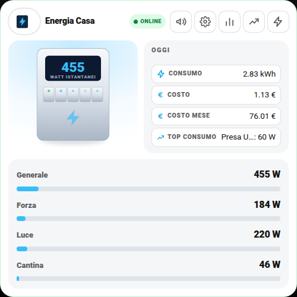

# ⚡ Card Energia Casa (`dm-energy-card`)

> 📘 La guida completa e sempre aggiornata di questa card (4 barre con entità e scala scelte da menu, notifiche Push / Alexa / Telegram con interruttori separati, layout) è nel repository dedicato: **[controllo_energia_casa](https://github.com/Simonz82/controllo_energia_casa)**.
Vista d'insieme del consumo elettrico di casa: potenza istantanea, ripartizione per circuito/stanza, confronto con il periodo precedente, interruttori rapidi, costi.

| Chiaro | Scuro |
|---|---|
|  |  |

## Cosa ti serve prima di iniziare

Un misuratore di **potenza generale casa** in Watt (un contatore smart, uno Shelly EM/3EM sul quadro, o il sensore che il tuo distributore espone via un'integrazione). Questo è l'unico prerequisito hardware reale; tutto il resto (circuiti, interruttori, soglie) è opzionale e si aggiunge un pezzo alla volta.

## 🚀 Metodo veloce: usa il mio package originale

Il package completo che uso io — soglie, notifiche push/Alexa/Telegram, costi, riepiloghi — è in [`packages/centro_controllo_energia.yaml`](../packages/centro_controllo_energia.yaml).

**Istruzioni:**

1. Copialo dentro `/config/packages/` (richiede i [Packages](https://www.home-assistant.io/docs/configuration/packages/) attivi in `configuration.yaml`: `homeassistant: packages: !include_dir_named packages`).
2. In cima al file trovi il blocco **`IMPOSTAZIONI PACKAGE`**:
   - `Sensore Consumo Generale W` → il TUO sensore di potenza generale casa
   - `Media Player Alexa 1` / `2` → i TUOI dispositivi Alexa (elimina le righe se non li usi)
3. Cerca `mobile_app_il_tuo_telefono` più giù nel file e sostituiscilo con il TUO `notify.mobile_app_xxx`.
4. Se non usi Telegram, cerca `telegram_bot.send_message` e cancella quei blocchi (oppure configura l'[integrazione Telegram](https://www.home-assistant.io/integrations/telegram/) e metti il tuo `chat_id` al posto del segnaposto).
5. Riavvia Home Assistant.
6. Aggiungi la card con la configurazione più sotto in questa guida, usando gli stessi nomi di entità/circuito che hai messo nel package.

Il resto di questa guida spiega come funziona ogni campo, utile se vuoi personalizzare oltre il minimo o costruire qualcosa di tuo da zero.

## Configurazione minima

```yaml
type: custom:dm-energy-card
name: Energia Casa
power_entity: sensor.potenza_casa_w
max_power: 4500          # fondo scala della barra (il tuo contatore/limite contrattuale)
```

## Campo per campo

| Campo | Obbligatorio | Descrizione |
|---|---|---|
| `power_entity` | **Sì** | `sensor` in Watt con la potenza istantanea totale |
| `name` | No | Titolo card |
| `max_power` | No | Fondo scala barra di potenza (es. la potenza contrattuale) |
| `top_entity` | No | `sensor` testuale con il nome del circuito che sta consumando di più in questo momento (calcolato da te con un template, se vuoi mostrarlo) |
| `soglia_entity` | No | `input_number` con la soglia oltre la quale scatta l'allarme "sovraccarico" |

### `periods` / `periods_prev` — box energia/costo per fascia temporale

Una riga per ogni periodo che vuoi mostrare (Ogni ora, Oggi, Settimana, Mese, ecc.), affiancata dal valore del periodo corrispondente precedente:

```yaml
periods:
  - label: Oggi
    energy: sensor.energia_oggi_casa      # kWh consumati nel periodo corrente
    cost: sensor.costo_oggi_casa          # € spesi nel periodo corrente
periods_prev:
  - label: Ieri
    energy: sensor.energia_oggi_casa      # stessa entità...
    energy_attr: last_period              # ...ma leggendo l'attributo "last_period" (tipico degli Utility Meter)
    cost: sensor.costo_ieri_casa
```

`energy`/`cost` in `periods` sono normalmente helper **Utility Meter** (Impostazioni → Helper → Contatore di utenza) agganciati al tuo sensore di energia totale, con ciclo di reset orario/giornaliero/settimanale/mensile/annuale a seconda della riga. `energy_attr: last_period` in `periods_prev` sfrutta il fatto che ogni Utility Meter, quando si azzera, salva il valore precedente in quell'attributo — comodo per il confronto "vs periodo prima" senza creare un secondo helper.

### `circuits` — ripartizione per stanza/circuito (opzionale)

```yaml
circuits:
  - label: Cucina
    entity: sensor.cucina_power
    max: 2000
  - label: Lavatrice
    entity: sensor.lavatrice_power
    max: 2000
```

Una riga per ogni sotto-misuratore che hai (prese smart, canali di uno Shelly 3EM, ecc.). `max` è solo il fondo scala della sua barra.

### `switches` — accensione rapida (opzionale)

```yaml
switches:
  - label: Presa Computer
    entity: switch.presa_computer
```

### `weekdays` / `media_entity` — storico settimanale (opzionale)

```yaml
weekdays:
  Lunedì: input_number.kwh_lunedi
  Martedì: input_number.kwh_martedi
  # ... fino a Domenica
media_entity: sensor.media_settimanale_kwh
```

Anche qui, gli `input_number` per giorno li popoli tu con un'automazione giornaliera (es. a mezzanotte, salva il valore dell'Utility Meter "oggi" nell'`input_number` del giorno corrispondente, poi resetta).

### `actions` — pulsanti con conferma (opzionale)

```yaml
actions:
  - label: Reset Contatori
    entity: script.reset_contatori_energia
    confirm: "Vuoi azzerare tutti i contatori di consumo energia? L'operazione non è reversibile."
```

### `settings_sections` — notifiche di soglia e consumo

```yaml
settings_sections:
  - title: Notifiche Soglia
    rows:
      - entity: input_boolean.notify_push_soglia
        label: Push
      - entity: input_boolean.notify_alexa_soglia
        label: Alexa
      - entity: input_number.soglia_casa_w
        label: Soglia W
      - entity: input_number.ritardo_soglia_secondi
        label: "Ritardo (s)"
  - title: Notifiche Consumi
    rows:
      - entity: input_boolean.notify_push_costi_giornalieri
        label: Giornalieri
      - entity: input_boolean.notify_push_costi_mensili
        label: Mensili
  - title: Costi
    rows:
      - entity: input_number.costo_energia
        label: "Costo energia (€/kWh)"
```

Le notifiche "soglia superata" e i riepiloghi costi giornaliero/mensile sono già scritti e pronti nel package [`../packages/centro_controllo_energia.yaml`](../packages/centro_controllo_energia.yaml) — vedi il paragrafo "🚀 Metodo veloce" in cima a questa guida. Per il pattern generale vedi anche [notifiche-personalizzate.md](notifiche-personalizzate.md); per il mini-linguaggio di `settings_sections` vedi [settings-sections.md](settings-sections.md).

## 🎛️ Layout classico o centrato

Questa card si può mostrare con la foto a sinistra (**classico**) oppure con la foto al centro in alto (**centrato**). Si sceglie dalla prima riga **Layout** delle Impostazioni: vedi la guida [Layout delle card](layout.md) per attivarla (menu `input_select.layout_energia` e parametro `layout_entity`).

```yaml
layout_entity: input_select.layout_energia
settings_sections:
  - title: Aspetto
    rows:
      - { entity: input_select.layout_energia, label: Layout }
  # ...le altre sezioni
```

| Classico | Centrato |
|---|---|
|  |  |

## 📈 Grafici

Il pulsante con la **linea che sale** apre il grafico storico in **24 h · 7 gg · 30 gg · da … a**. Il grafico mostra i **circuiti** (parte dal Generale; con le chip accendi le altre curve, sovrapposte). Vedi la guida completa: [Grafici](grafici.md).

| Chiaro | Scuro |
|---|---|
|  |  |
