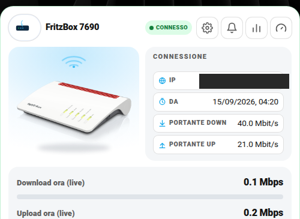

# 📶 Card FritzBox / Router (`dm-fritz-card`)

Stato della connessione, banda impegnata, velocità live, pulsanti rapidi (cambio IP, riavvio), test di velocità.



## Cosa ti serve prima di iniziare

Pensata per un router **AVM FritzBox** con l'integrazione ufficiale **FRITZ!Box Tools** (Impostazioni → Dispositivi e servizi → Aggiungi integrazione → cerca "FRITZ!Box Tools", inserisci IP/utente/password del router). Quell'integrazione crea da sola quasi tutti i sensori che servono qui, senza bisogno di template personalizzati. Se hai un router diverso, puoi comunque usare la card: ti basta avere un `binary_sensor`/`sensor` che rappresenti "online/offline" per `connection_entity`, il resto dei campi è tutto opzionale.

## Configurazione minima

```yaml
type: custom:dm-fritz-card
name: FritzBox
connection_entity: sensor.fritzbox    # stato/connettività del router
```

## Campo per campo

| Campo | Obbligatorio | Descrizione |
|---|---|---|
| `connection_entity` | **Sì** | Entità di stato/connettività creata dall'integrazione FRITZ!Box Tools |
| `name` | No | Titolo card |
| `max_mbps` | No | Fondo scala barre download/upload live |
| `update_entity` | No | Entità `update.` per il firmware — creata automaticamente dalla stessa integrazione se c'è un aggiornamento disponibile |

### `stats` — dati di banda (di solito già pronti dall'integrazione)

```yaml
stats:
  portante_down: sensor.portante_download_agganciata   # velocità massima della linea, in ricezione
  portante_up: sensor.portante_upload_agganciata        # velocità massima della linea, in invio
  mbps_down: sensor.download_mbps                       # velocità istantanea in Mbps
  mbps_up: sensor.upload_mbps
  mbs_down: sensor.download_mbs                         # velocità istantanea in MB/s
  mbs_up: sensor.upload_mbs
```

I nomi esatti dipendono dalla versione dell'integrazione — controlla in Impostazioni → Dispositivi e servizi → FRITZ!Box Tools → Entità quali sensori di banda sono effettivamente disponibili sul tuo router, i nomi qui sono solo un esempio.

### `actions` — pulsanti con conferma

L'integrazione FRITZ!Box Tools espone due **servizi** nativi molto utili: `fritzbox.reconnect` (cambia IP pubblico riconnettendosi) e `fritzbox.reboot` (riavvia il router). La card si aspetta un'entità da "premere", quindi il modo più semplice è avvolgerli in due piccoli script:

```yaml
script:
  fritz_box_riconnetti:
    sequence:
      - service: fritzbox.reconnect
  fritz_box_riavvia:
    sequence:
      - service: fritzbox.reboot
```

```yaml
actions:
  - entity: script.fritz_box_riconnetti
    label: Cambia IP
    confirm: "Vuoi cambiare IP?"
  - entity: script.fritz_box_riavvia
    label: Riavvia FritzBox
    confirm: "Vuoi riavviare il FritzBox?"
```

### `speedtest` — risultati dell'ultimo test di velocità (opzionale)

```yaml
speedtest:
  download: sensor.ookla_speedtest_download
  upload: sensor.ookla_speedtest_upload
  ping: sensor.ookla_speedtest_ping
  jitter: sensor.ookla_speedtest_jitter
  last_test: sensor.ookla_speedtest_last_test
```

Questi arrivano dall'integrazione HACS [**Ookla Speedtest**](https://github.com/lstrojny/hass-ookla-speedtest) (Speedtest.net ufficiale) — installala da HACS, configurala, e i nomi entità di default combaciano già con l'esempio sopra.

### `settings_sections` — notifiche

```yaml
settings_sections:
  - title: Notifiche
    rows:
      - entity: input_boolean.notify_push_fritz
        label: Notifica Online
      - entity: input_boolean.notify_alexa_fritz
        label: Notifica Alexa
      - entity: input_boolean.notify_ip_push
        label: Notifica Cambio IP
      - entity: input_datetime.orario_inizio_notifiche_fritz
        label: Inizio fascia
      - entity: input_datetime.orario_fine_notifiche_fritz
        label: Fine fascia
```

Per il pattern notifiche completo (automazione che legge questi interruttori) vedi [notifiche-personalizzate.md](notifiche-personalizzate.md).
