# 📈 Grafici: 24 h · 7 gg · 30 gg · da … a

Ogni card ha un pulsante con una **linea che sale** (accanto a quello delle barrette "Statistiche"). Toccandolo si apre una finestra con il **grafico storico** del dispositivo, in **quattro periodi**:

| Periodo | Cosa mostra |
|---|---|
| **24 h** | le ultime 24 ore |
| **7 gg** | gli ultimi 7 giorni |
| **30 gg** | gli ultimi 30 giorni |
| **Da … a** | due date a scelta (inizio e fine, con l'ora): scegli il periodo e premi **Applica** |

Non c'è nulla da configurare: il grafico usa i sensori che hai già indicato nella card.

## Come si presenta

| Chiaro | Scuro |
|---|---|
| 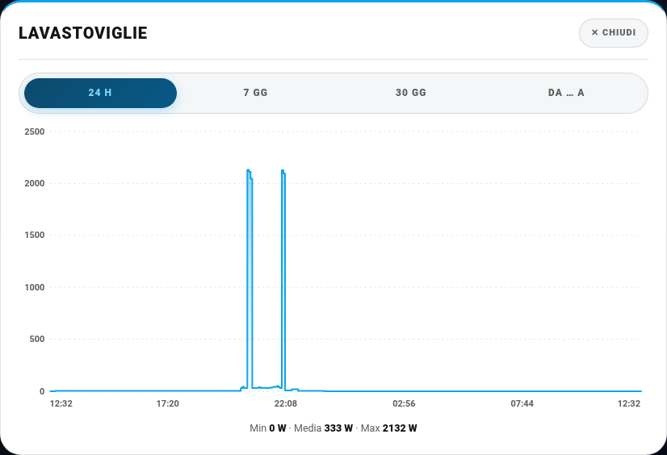 | 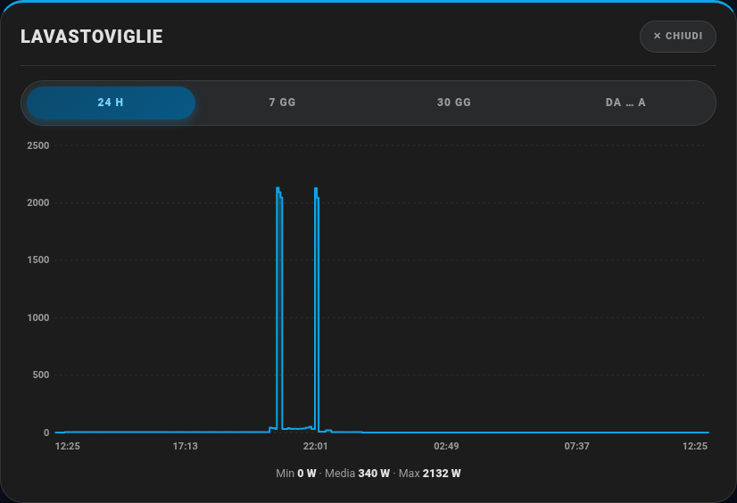 |

- I **periodi** sono le pillole in alto; quello attivo è evidenziato.
- Passando con il mouse (o toccando col dito) sul grafico compare una **linea guida** con il valore e l'ora precisi.
- Sotto il grafico trovi **minimo, media e massimo** del periodo.
- Segue il tema chiaro/scuro di Home Assistant.

### 7 giorni, 30 giorni e date a scelta

| 7 gg | 30 gg |
|---|---|
| 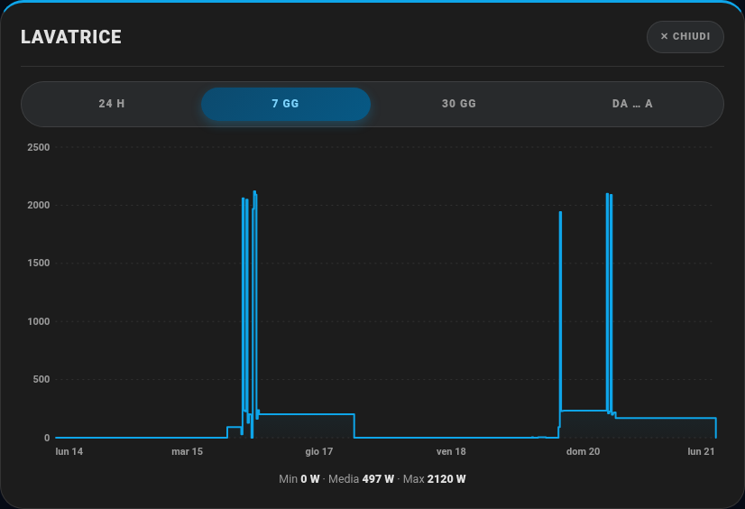 | 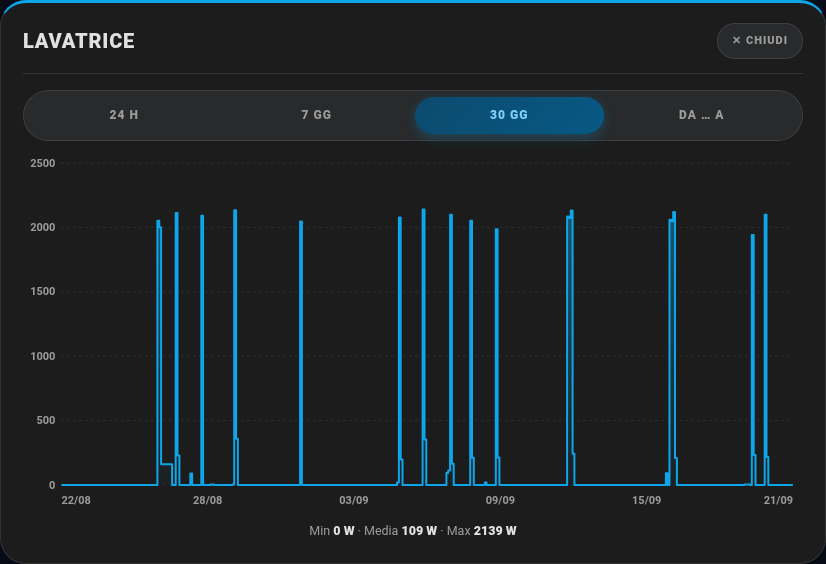 |

| Da … a: si scelgono le date | Da … a: risultato |
|---|---|
| 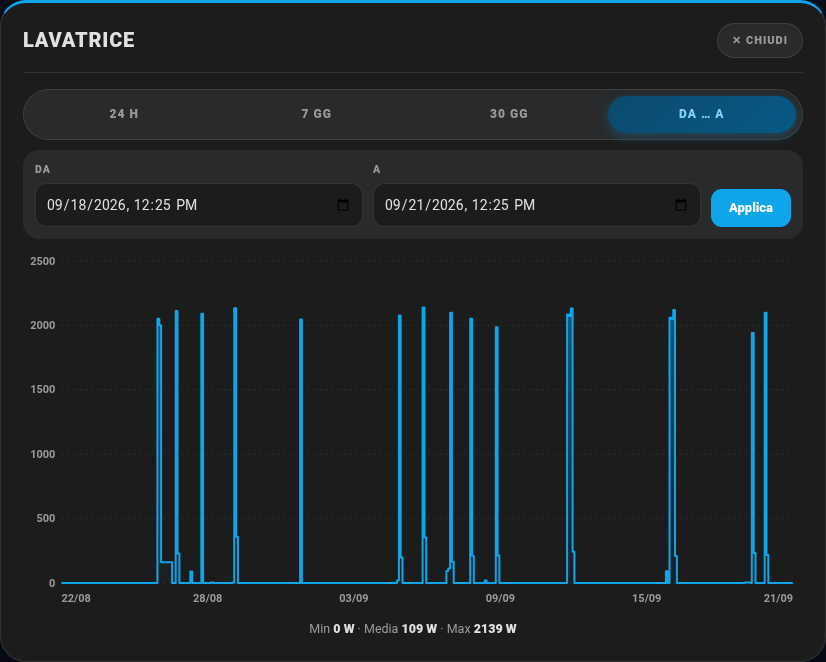 | 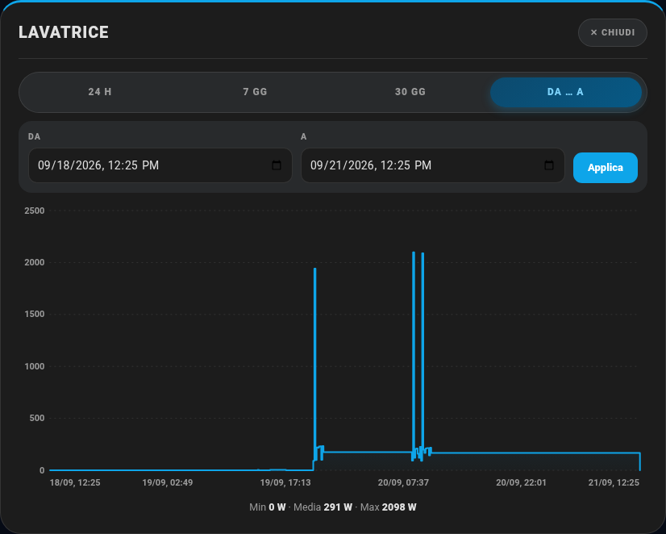 |

## Su PC e su smartphone

Il grafico **si adatta allo schermo**: su PC è largo e alto, su smartphone la finestra sale dal basso, occupa più di metà schermo e il grafico si restringe (meno etichette sull'asse, così restano leggibili).

| Smartphone – 24 h | Smartphone – 7 gg | Smartphone – FritzBox |
|---|---|---|
| 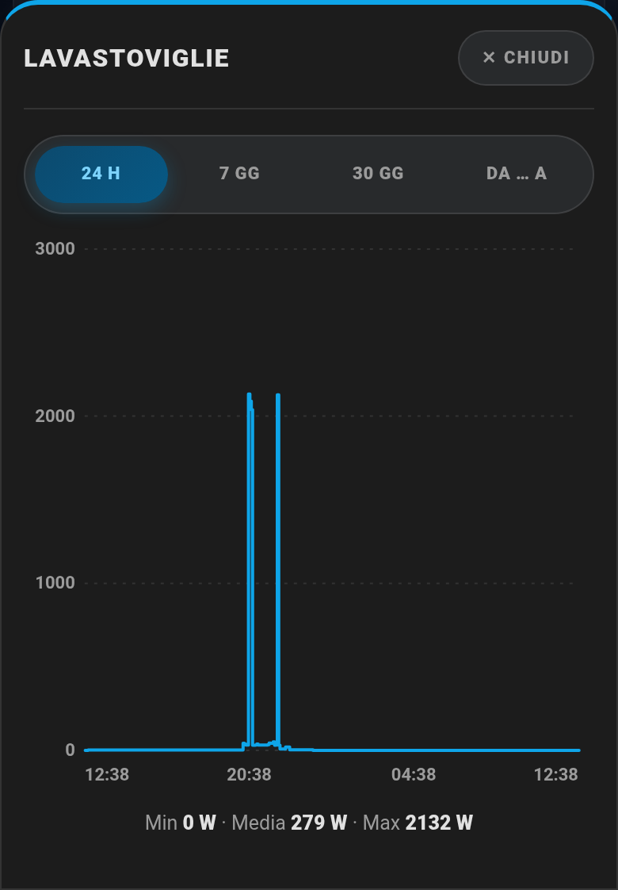 | 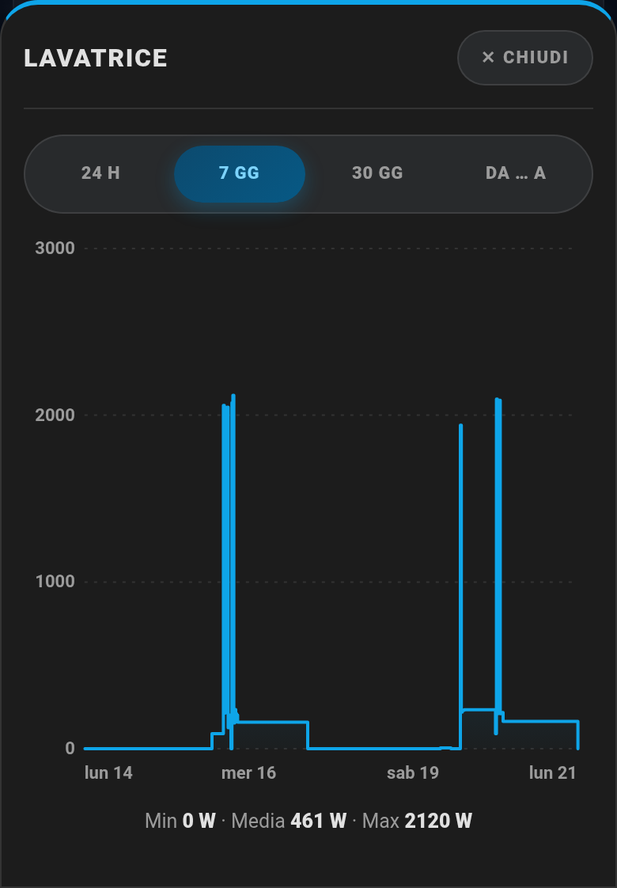 | 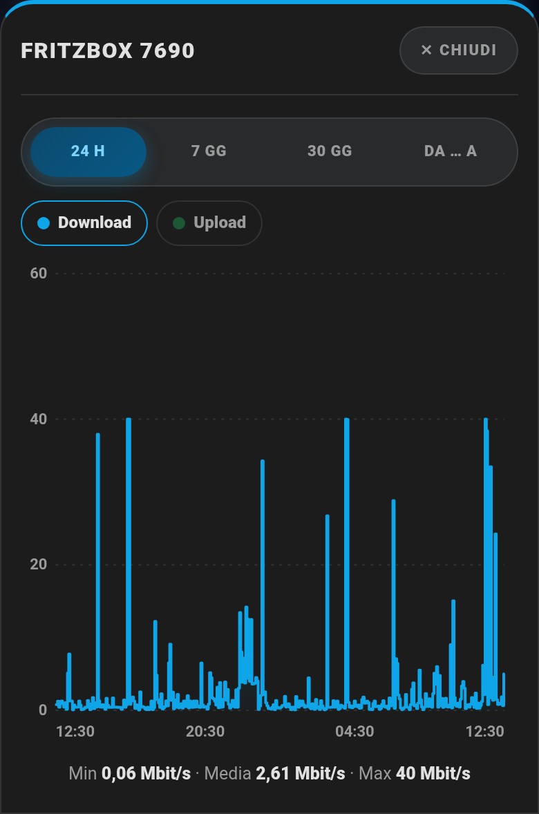 |

## Cosa disegna ogni card

| Card | Curve nel grafico |
|---|---|
| [Elettrodomestici](elettrodomestici.md) | la **potenza** (`power_history_entity`, oppure `power_entity`) |
| [Energia Casa](energia.md) | i **circuiti** (Generale, Forza, Luce, Cantina, …): parte dal Generale, con le "chip" in alto accendi/spegni le altre curve |
| [FritzBox](fritzbox.md) | **Download** e **Upload** (`stats.mbps_down` e `stats.mbps_up`) |
| [Server Home Assistant](homeassistant-server.md) | **CPU**, **RAM**, **Disco** |
| [NAS Synology](nas-synology.md) | **CPU**, **RAM**, **Volume 1 e 2**, **USB**, **Temperatura** |
| [Proxmox](proxmox.md) | **CPU**, **RAM**, **Disco**, **Temperatura CPU**, **GPU** |
| [UPS](ups.md) | **Batteria** e **Carico** |

Dove ci sono più curve compaiono in alto dei **pulsanti-chip**: toccandone uno accendi o spegni quella curva. Le curve con la **stessa unità** (per esempio più consumi in W) si sovrappongono nello stesso grafico; scegliendo una curva con un'unità diversa (per esempio una temperatura) il grafico passa solo a quella.

| Energia (curve sovrapposte) | FritzBox (Download + Upload) |
|---|---|
| 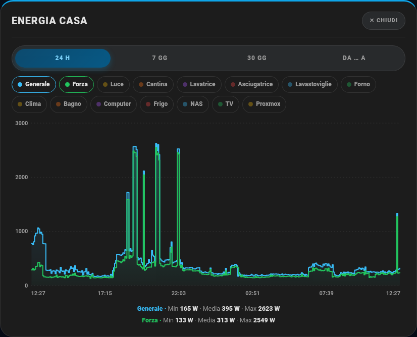 | 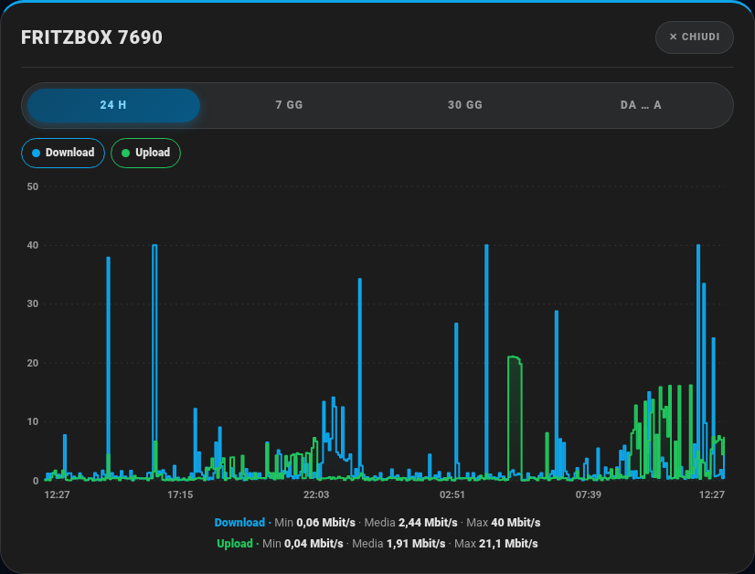 |

Il grafico si apre anche **toccando una barra** della card (per esempio la barra della CPU o del carico): mostra la curva di quel solo valore.

### Tutte le card

| Lavatrice | Asciugatrice | Lavastoviglie |
|---|---|---|
| 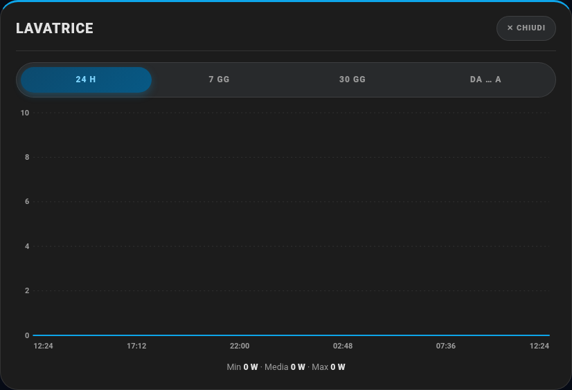 | 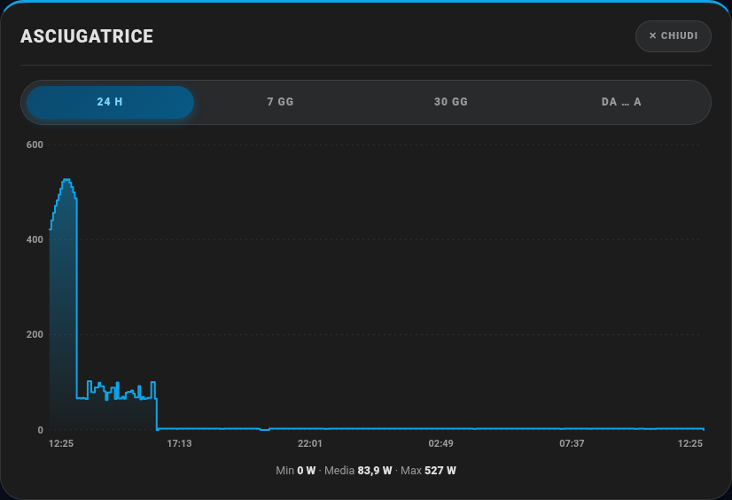 |  |

| Forno | TV | Energia Casa |
|---|---|---|
| 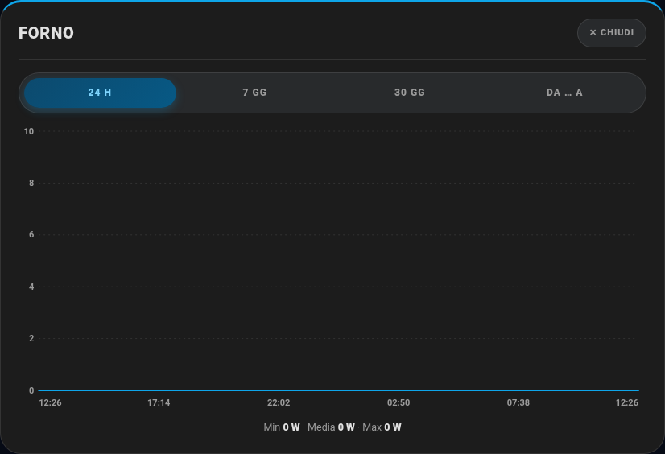 | 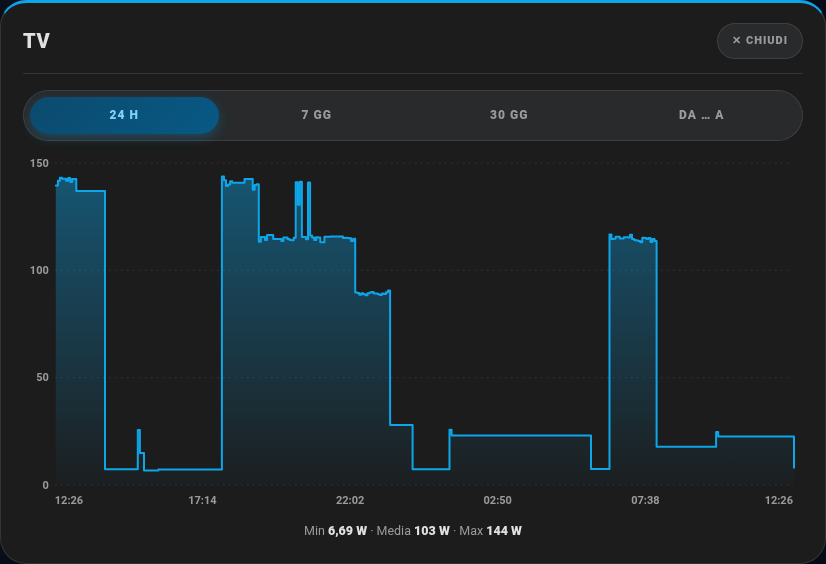 |  |

| FritzBox | Server HA | NAS |
|---|---|---|
| 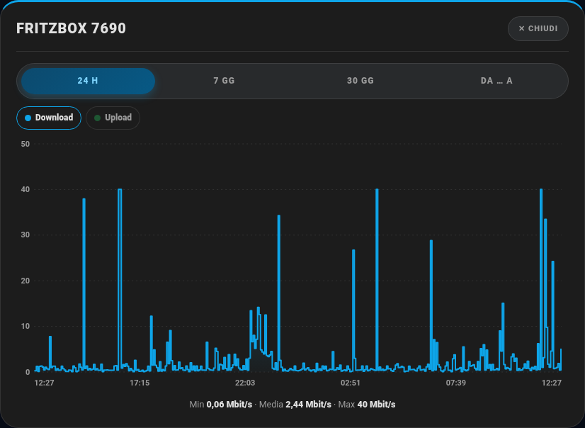 |  | 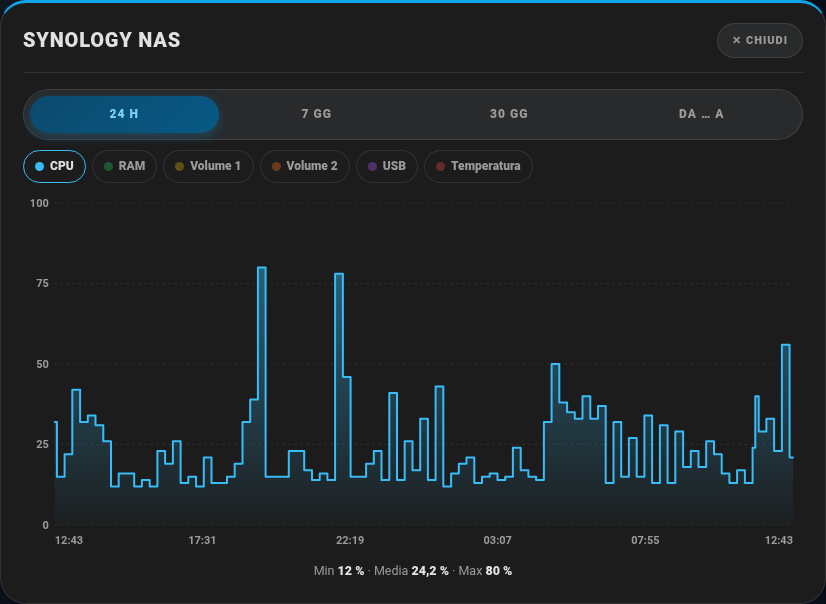 |

| Proxmox | UPS |
|---|---|
|  | 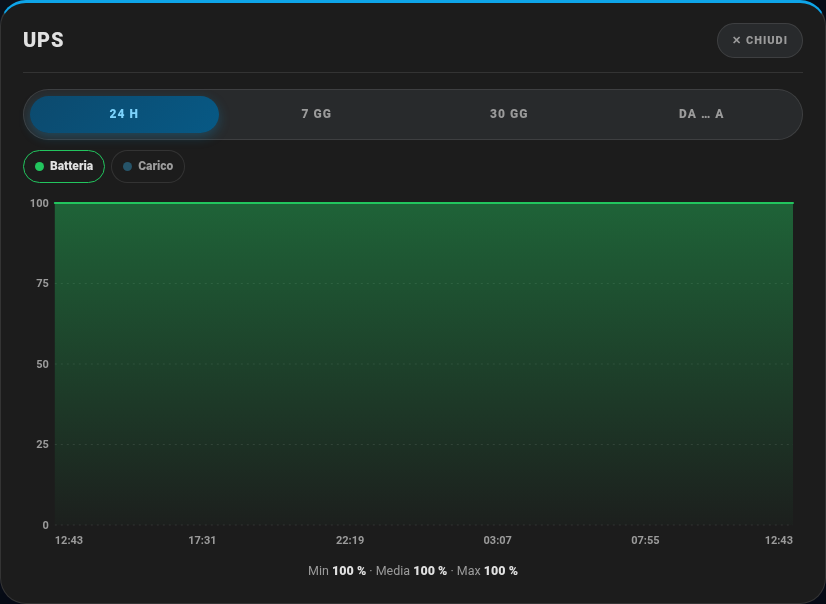 |

## Come vengono presi i dati (e perché i picchi sono veri)

- **Fino a 8 giorni** il grafico legge la **cronologia reale** del sensore. Per i sensori "istantanei" (potenza in W, corrente, banda di rete) tiene il **picco** di ogni intervallo: se la lavatrice arriva a 2 100 W per scaldare l'acqua, nel grafico vedi 2 100 W, non una media appiattita.
- **Oltre 8 giorni** (30 gg, o date a scelta lontane) usa le **statistiche a lungo termine** di Home Assistant: per la potenza il **massimo orario**, per gli altri sensori (%, °C) la media oraria.
- La linea è **a gradini**: un valore resta valido fino al cambio successivo, come lo stato reale del sensore.
- Se per un sensore non ci sono dati nel periodo, il grafico lo dice ("Nessun dato nel periodo").

> **Consiglio:** la cronologia dettagliata che Home Assistant conserva è quella del `recorder` (di solito 10 giorni; in `recorder:` puoi alzarlo, per esempio con `purge_keep_days: 30`). I sensori con una **classe di stato** (`state_class: measurement`, quelli di potenza/energia lo hanno) restano nelle statistiche a lungo termine per anni, quindi il periodo "Da … a" funziona anche indietro nel tempo.

## Statistiche (pulsante con le barrette)

Il pulsante con le **barrette** apre invece le **Statistiche**. Nelle card degli **elettrodomestici** contiene tutto lo storico dei consumi:

| Chiaro | Scuro |
|---|---|
| 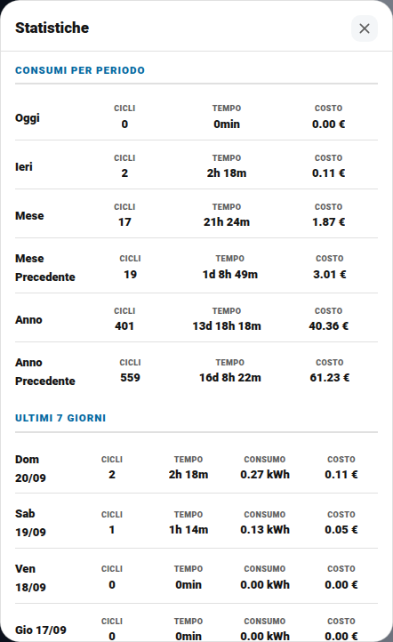 | 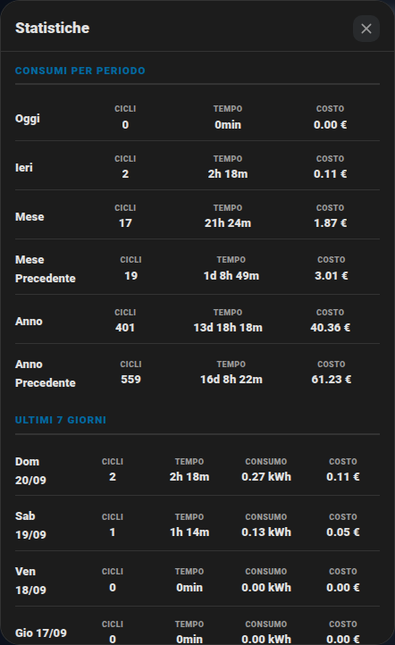 |

- **Consumi per periodo**: oggi, ieri, mese, mese precedente, anno, anno precedente (cicli, tempo, costo).
- **Ultimi 7 giorni**, giorno per giorno: cicli, tempo, consumo e costo.
- Due **istogrammi**: il consumo di questo mese (kWh al giorno) e di quest'anno (kWh al mese).

| Istogrammi mese e anno |
|---|
| 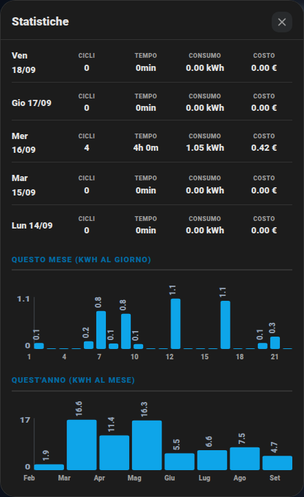 |

Se la card ha anche i sensori dei consumi (`period_attrs`, `week_rows`, `energy_stat_entity`, come nel package originale) questi dati compaiono da soli: vedi [Elettrodomestici](elettrodomestici.md).
