# 🖥️ Card Server Home Assistant (`shc-server-card`)

CPU/RAM/disco del server che fa girare Home Assistant, aggiornamenti disponibili, backup, riavvii programmati, certificato SSL, conteggio entità.

| Chiaro | Scuro |
|---|---|
| 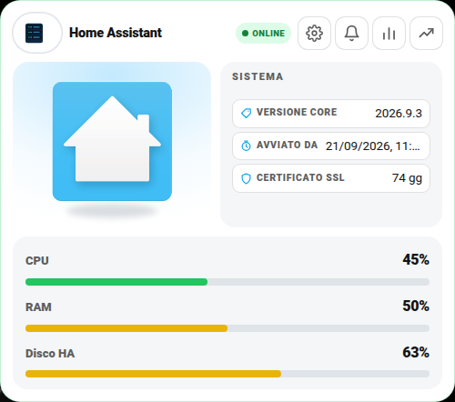 | 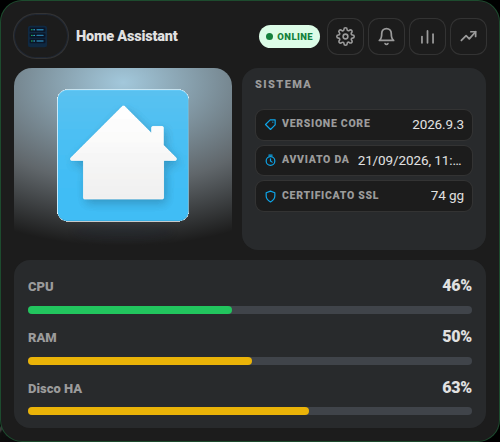 |

Nessun campo è obbligatorio — la card si carica comunque anche vuota — ma senza almeno `sensors.cpu`/`ram_pct`/`disk_pct` non mostra granché.

## 🚀 Metodo veloce: usa il mio package originale

Il package completo — report giornaliero, notifiche login/aggiornamenti/SSL, soglie di allarme, backup e riavvii programmati — è in [`packages/statistiche_ha.yaml`](../packages/statistiche_ha.yaml) (il file più corposo della raccolta, ma quasi tutto è già pronto).

**Istruzioni:**

1. Copialo dentro `/config/packages/` (richiede i [Packages](https://www.home-assistant.io/docs/configuration/packages/) attivi).
2. In cima al file, blocco **`IMPOSTAZIONI PACKAGE`**:
   - `Sensore Power Server` → il TUO sensore di potenza (Watt) del server, se ne hai uno (una presa smart a monte); se non lo misuri, lascialo com'è, quel dato semplicemente non comparirà
   - `Sensore Temperatura` → il TUO sensore di temperatura del server/NAS (c'è già una riga alternativa commentata con `sensor.processor_temperature`, tipico di un Raspberry Pi — scommenta quella se ti si addice di più)
   - `Sensore Certificato SSL` → il TUO sensore [Cert Expiry](https://www.home-assistant.io/integrations/cert_expiry/)
   - `Ventola Rack` → cancella questa riga se non hai una ventola/rack monitorato, è specifico al mio setup
   - `Device per notifica push` → il TUO `notify.mobile_app_xxx`
3. Riavvia Home Assistant, poi aggiungi la card con la configurazione più sotto in questa guida.

## Cosa ti serve prima di iniziare

La maggior parte dei sensori qui sotto arriva dall'integrazione core **[System Monitor](https://www.home-assistant.io/integrations/systemmonitor/)** (Impostazioni → Dispositivi e servizi → Aggiungi integrazione → cerca "System Monitor") — gratuita, già inclusa in Home Assistant, non serve installare nulla.

## 🖊️ Editor visuale (senza YAML)

Non serve scrivere configurazione a mano: "Aggiungi card" → cerca **"Server Home Assistant"** → compila i campi, ogni entità si cerca per nome con anteprima. Lo stesso editor si apre anche per modificare una card già aggiunta (pulsante "⋮" sulla card in modalità modifica → "Edit").

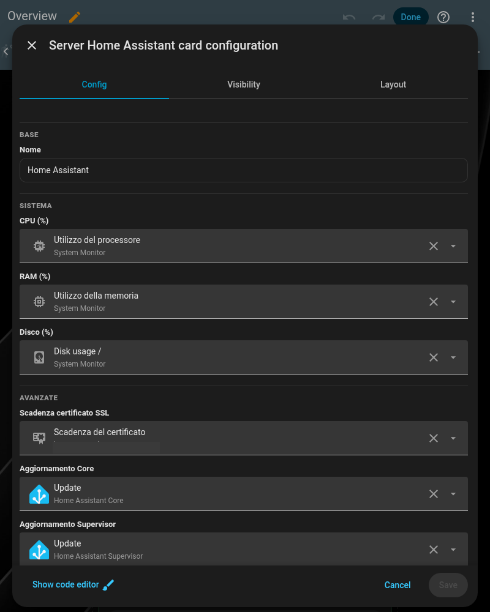

⚠️ **Non scrive `settings_sections` / `actions`**: sono elenchi troppo complessi per un editor a campi. Senza quelli, l'icona ⚙️ sulla card si apre ma mostra solo "Nessuna impostazione configurata" — non è un errore, è normale finché non li aggiungi a mano dal blocco YAML qui sotto (o dal paragrafo "🚀 Metodo veloce" in cima alla guida).

## `sensors`

```yaml
sensors:
  cpu: sensor.processor_use
  cpu_speed: sensor.cpu_speed
  ram_pct: sensor.memory_use_percent
  ram_used: sensor.memory_use
  ram_total: sensor.ram_totale              # System Monitor non lo dà già pronto: un input_number/template con la RAM totale del tuo server
  disk_pct: sensor.disk_use_percent
  disk_used: sensor.disk_use
  disk_free: sensor.disk_free
  disk_total: sensor.disk_total
  local_ip: sensor.local_ip                 # System Monitor la espone come "IPv4 address"
  public_ip: sensor.ip_pubblico             # serve un sensore esterno, es. integrazione "External IP" o un template su un servizio come ipify.org
```

## `updates` — aggiornamenti disponibili

```yaml
updates:
  core: update.home_assistant_core_update
  supervisor: update.home_assistant_supervisor_update   # solo se hai Supervisor (HA OS/Supervised)
  addon_count: sensor.supervisor_updates                # quanti addon hanno un aggiornamento in sospeso
  hacs_count: sensor.hacs                                # se usi HACS, conta i repository con update disponibile
```

## `uptime`

```yaml
uptime:
  ha_since: sensor.uptime                                       # da quando Home Assistant (il processo) è avviato
  ha_duration: sensor.tempo_di_avvio_homeassistant              # quanto ha impiegato ad avviarsi, se lo calcoli con un template
  server_since: sensor.last_boot                                # da quando il SISTEMA (System Monitor) è avviato
  server_duration: sensor.tempo_avvio_server                    # opzionale, template
```

## Altri campi

| Campo | Descrizione |
|---|---|
| `ssl_cert` | Giorni alla scadenza del certificato HTTPS — l'integrazione core **[Cert Expiry](https://www.home-assistant.io/integrations/cert_expiry/)** lo crea da sola |
| `db_size` | Dimensione del database Recorder (se usi MariaDB/PostgreSQL esterni, spesso hanno un proprio sensore; con SQLite di default puoi usare un `command_line` sensor su `home-assistant_v2.db`) |
| `last_backup` | Sensore dell'integrazione core **[Backup](https://www.home-assistant.io/integrations/backup/)**, con data/esito dell'ultimo backup automatico |
| `entity_count` | Un `sensor` testuale/numerico totale entità, calcolato da te con un template (`{{ states | count }}`) |
| `entity_domains` | Lista di `{attr, label}`: legge gli **attributi** di `entity_count` (uno per dominio) — vedi esempio sotto |

Esempio di template per `entity_count`/`entity_domains`:

```yaml
template:
  - sensor:
      - name: "conteggio_entita"
        state: "{{ states | count }}"
        attributes:
          automation: "{{ states.automation | count }}"
          automation_ON: "{{ states.automation | selectattr('state','eq','on') | list | count }}"
          sensor: "{{ states.sensor | count }}"
          binary_sensor: "{{ states.binary_sensor | count }}"
          switch: "{{ states.switch | count }}"
          light: "{{ states.light | count }}"
```

```yaml
entity_count: sensor.conteggio_entita
entity_domains:
  - attr: automation
    label: Automazioni
  - attr: automation_ON
    label: Automazioni Attive
  - attr: sensor
    label: Sensori
```

## `actions`

```yaml
actions:
  - label: Backup Ora
    entity: script.backup_ha              # uno script che chiama il servizio backup.create
  - label: Riavvia Home Assistant
    service: homeassistant.restart
    confirm: "Vuoi riavviare Home Assistant?"
  - label: Riavvia Server
    service: hassio.host_reboot           # solo su HA OS/Supervised
    confirm: "Vuoi riavviare il server fisico? Tutti i servizi si fermeranno per qualche minuto."
```

Le azioni accettano sia `entity` (uno script/button da premere) sia `service` (chiamata diretta a un servizio, utile per servizi "di sistema" come `homeassistant.restart` che non hanno bisogno di uno script dedicato).

## `settings_sections` — report, notifiche, backup e riavvii programmati

Questa card usa a fondo il tipo di riga `group` — vedi [settings-sections.md](settings-sections.md) per la spiegazione generale. Esempio realistico per "Riavvio HA programmato":

```yaml
settings_sections:
  - title: Riavvio HA programmato
    rows:
      - type: group
        icon: restart
        label: Riavvio HA
        toggle: input_boolean.on_off_riavvio_ha
        time: input_datetime.orario_riavvio_homeassistant
        days:
          - input_boolean.ha_riavvio_lunedi
          - input_boolean.ha_riavvio_martedi
          - input_boolean.ha_riavvio_mercoledi
          - input_boolean.ha_riavvio_giovedi
          - input_boolean.ha_riavvio_venerdi
          - input_boolean.ha_riavvio_sabato
          - input_boolean.ha_riavvio_domenica
  - title: Soglie Alert
    rows:
      - type: group
        icon: alert
        label: Alert Server
        toggle: input_boolean.on_off_alert_ha
        numbers:
          - entity: input_number.utilizzo_disco
            label: Disco
          - entity: input_number.utilizzo_ram
            label: RAM
          - entity: input_number.utilizzo_cpu
            label: CPU
        extraToggles:
          - entity: input_boolean.alert_ram
            label: Alert RAM
          - entity: input_boolean.alert_cpu
            label: Alert CPU
```

Report, notifiche, controllo aggiornamenti, soglie di allarme, backup e riavvii programmati sono tutti già scritti e pronti nel package [`../packages/statistiche_ha.yaml`](../packages/statistiche_ha.yaml) — vedi il paragrafo "🚀 Metodo veloce" in cima a questa guida. Il pattern generale, se vuoi aggiungere una notifica in più, è comunque spiegato in [notifiche-personalizzate.md](notifiche-personalizzate.md).

## Campi legacy (non usarli in un'installazione nuova)

`legacy_settings_popup` e `legacy_stats_popup` esistono solo per compatibilità con configurazioni molto vecchie basate su popup `browser_mod` invece del popup nativo della card — se stai partendo da zero, ignorali del tutto e usa `settings_sections`.

## 🎛️ Layout classico o centrato

Questa card si può mostrare con la foto a sinistra (**classico**) oppure con la foto al centro in alto (**centrato**). Si sceglie dalla prima riga **Layout** delle Impostazioni: vedi la guida [Layout delle card](layout.md) per attivarla (menu `input_select.layout_server` e parametro `layout_entity`).

```yaml
layout_entity: input_select.layout_server
settings_sections:
  - title: Aspetto
    rows:
      - { entity: input_select.layout_server, label: Layout }
  # ...le altre sezioni
```

| Classico | Centrato |
|---|---|
| 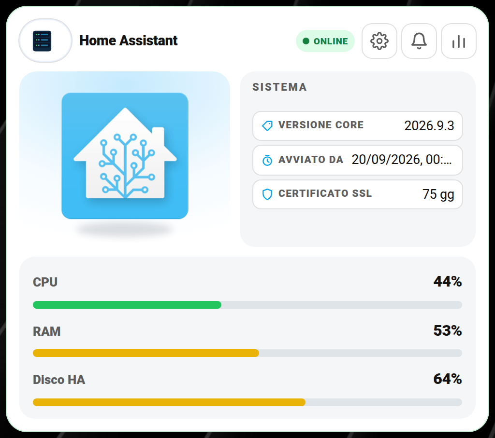 | 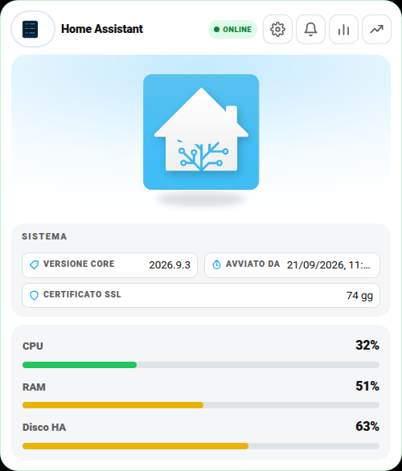 |

## 📈 Grafici

Il pulsante con la **linea che sale** apre il grafico storico in **24 h · 7 gg · 30 gg · da … a**. Il grafico mostra **CPU**, **RAM** e **Disco**. Vedi la guida completa: [Grafici](grafici.md).

| Chiaro | Scuro |
|---|---|
| 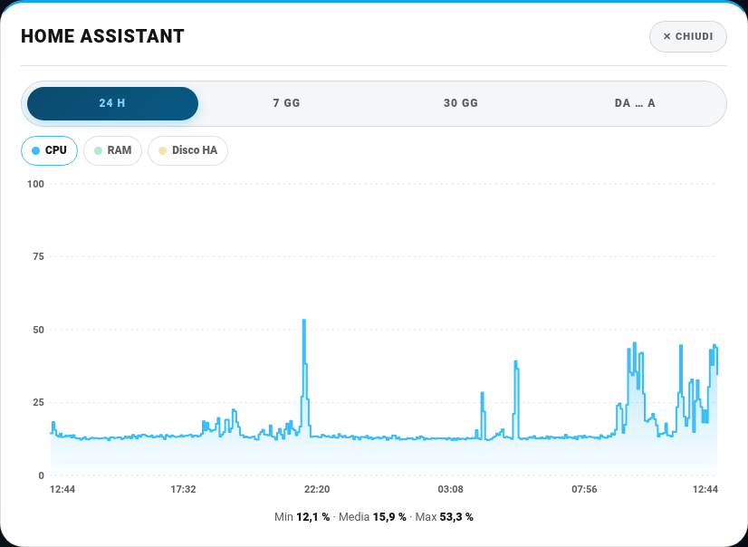 | 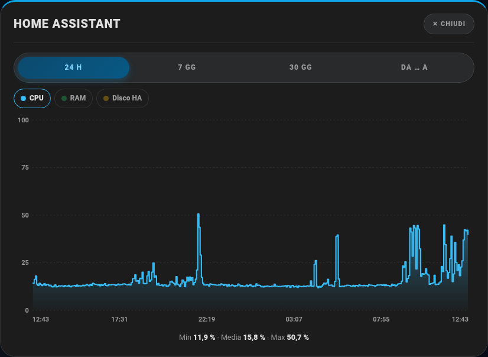 |

## 🖼️ Tutte le schermate

Tutti i popup della card, con i dati sensibili (indirizzi IP, nomi, ecc.) oscurati.

**Impostazioni (ingranaggio)**

| Chiaro | Scuro |
|---|---|
| 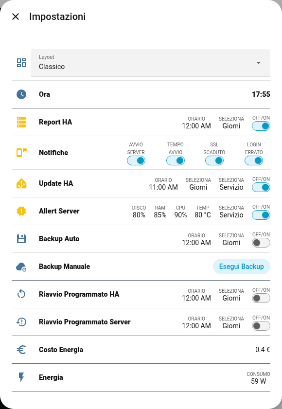 | 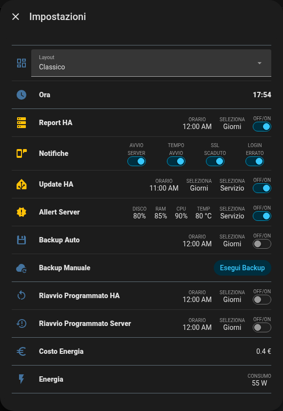 |

**Aggiornamenti (campanella)**

| Chiaro | Scuro |
|---|---|
| 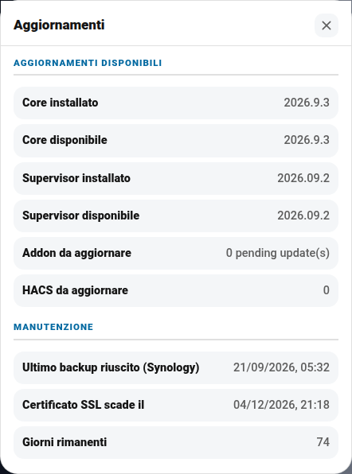 | 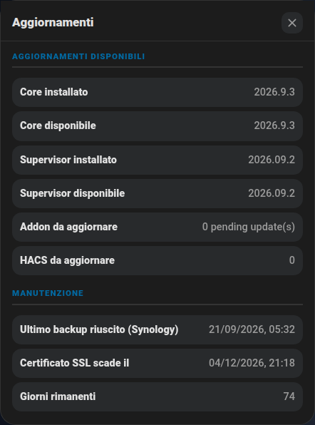 |

**Statistiche (barrette)**

| Chiaro | Scuro |
|---|---|
| 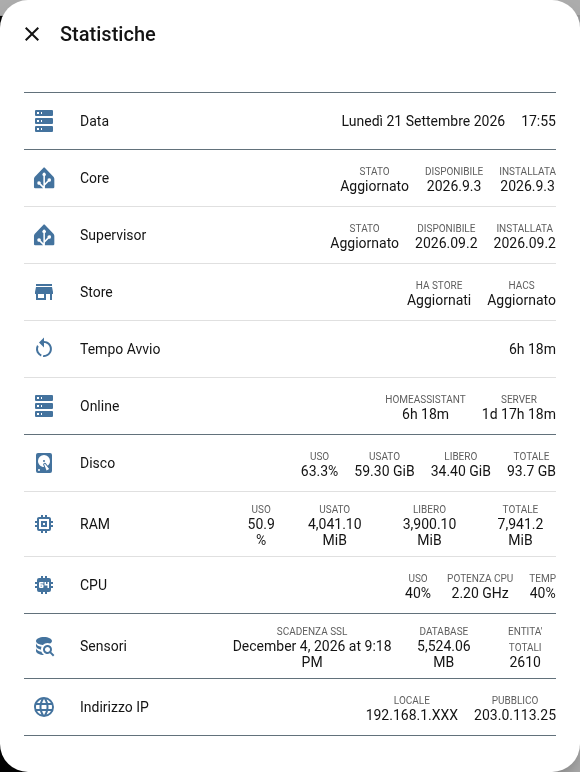 | 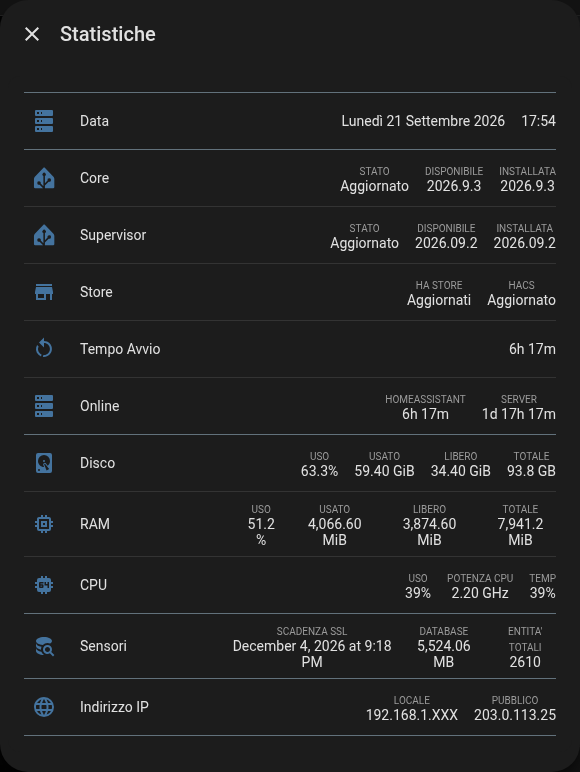 |
