# 💾 Card NAS Synology (`dm-nas-card`)

CPU/RAM/volumi/dischi del NAS, stato di sicurezza, consumo elettrico, pulsanti di riavvio/spegnimento.

| Chiaro | Scuro |
|---|---|
| 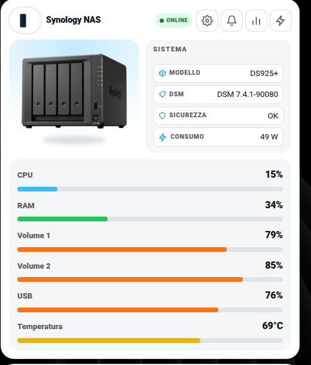 |  |

## Cosa ti serve prima di iniziare

L'integrazione ufficiale **[Synology DSM](https://www.home-assistant.io/integrations/synology_dsm/)** (Impostazioni → Dispositivi e servizi → Aggiungi integrazione → cerca "Synology DSM", inserisci IP/utente/password del NAS). Crea da sola quasi tutti i sensori usati qui sotto — controlla i nomi esatti in Impostazioni → Entità dopo averla configurata, variano leggermente in base al modello.

## Campo per campo

| Campo | Obbligatorio | Descrizione |
|---|---|---|
| `update_entity` | **Sì** | Entità `update.` per il firmware DSM, creata dall'integrazione Synology DSM |
| `name` | No | Titolo card (default `"Synology NAS"`) |
| `model` | No | Testo libero, es. `"DS925+"` |
| `security_entity` | No | `binary_sensor` stato di sicurezza del NAS (Synology lo espone nativamente) |

### `sensors`

```yaml
sensors:
  cpu: sensor.nas_utilizzo_cpu_totale
  cpu_user: sensor.nas_utilizzo_cpu_utente
  load5: sensor.nas_carico_medio_cpu_5_min
  load15: sensor.nas_carico_medio_cpu_15_min
  ram_pct: sensor.nas_utilizzo_memoria
  ram_free: sensor.nas_memoria_disponibile
  ram_total: sensor.nas_memoria_totale
  vol1: sensor.nas_volume_1_utilizzato       # % di spazio usato
  vol1_label: "Volume 1"                     # etichetta a piacere
  vol2: sensor.nas_volume_2_utilizzato
  vol2_label: "Volume 2"
  usb_pct: sensor.nas_usb_disk_1_utilizzato  # opzionale, se hai un disco USB collegato
  net_down: sensor.nas_velocita_download
  net_up: sensor.nas_velocita_upload
  temp: sensor.nas_temperatura
```

Tutti opzionali singolarmente: metti solo quelli che la tua integrazione espone davvero (es. `usb_pct`/`vol2` non esistono se non hai quei dischi).

### `volumes` / `disks` — dettaglio per singolo volume/unità (opzionale)

```yaml
volumes:
  - label: "Volume 1"
    status_entity: sensor.nas_volume_1_stato
    temp_entity: sensor.nas_volume_1_temperatura
disks:
  - label: "Unità 1"
    status_entity: sensor.nas_unita_1_stato
    temp_entity: sensor.nas_unita_1_temperatura
  - label: "M.2 1"                            # se hai cache/storage su slot M.2
    status_entity: sensor.nas_unita_m2_1_stato
    temp_entity: sensor.nas_unita_m2_1_temperatura
```

Una riga per ogni volume/disco fisico che vuoi monitorare separatamente. Anche questi arrivano dall'integrazione Synology DSM.

### `energy` — consumo elettrico (opzionale)

Il NAS in sé non sa quanto consuma: serve una presa smart con misura di potenza/energia a monte.

```yaml
energy:
  power: sensor.presa_nas_power           # Watt istantanei
  today_kwh: sensor.presa_nas_energia_oggi
  month_kwh: sensor.presa_nas_energia_mese
```

### `actions` — riavvio/spegnimento con conferma

L'integrazione Synology DSM espone dei `button.` nativi per riavvio e spegnimento — bastano quelli, senza bisogno di script:

```yaml
actions:
  - label: Riavvia NAS
    entity: button.nas_reboot
    confirm: "Vuoi riavviare il NAS Synology?"
  - label: Spegni NAS
    entity: button.nas_shutdown
    confirm: "Vuoi spegnere il NAS Synology? Tutti i servizi si fermeranno."
```

## Esempio completo

```yaml
type: custom:dm-nas-card
name: Synology NAS
model: "DS925+"
update_entity: update.nas_aggiornamento_dsm
security_entity: binary_sensor.nas_stato_sicurezza
sensors:
  cpu: sensor.nas_utilizzo_cpu_totale
  ram_pct: sensor.nas_utilizzo_memoria
  vol1: sensor.nas_volume_1_utilizzato
  vol1_label: "Volume 1"
  temp: sensor.nas_temperatura
actions:
  - label: Riavvia NAS
    entity: button.nas_reboot
    confirm: "Vuoi riavviare il NAS Synology?"
```

## 🎛️ Layout classico o centrato

Questa card si può mostrare con la foto a sinistra (**classico**) oppure con la foto al centro in alto (**centrato**). Si sceglie dalla prima riga **Layout** delle Impostazioni: vedi la guida [Layout delle card](layout.md) per attivarla (menu `input_select.layout_nas` e parametro `layout_entity`).

```yaml
layout_entity: input_select.layout_nas
settings_sections:
  - title: Aspetto
    rows:
      - { entity: input_select.layout_nas, label: Layout }
  # ...le altre sezioni
```

| Classico | Centrato |
|---|---|
| 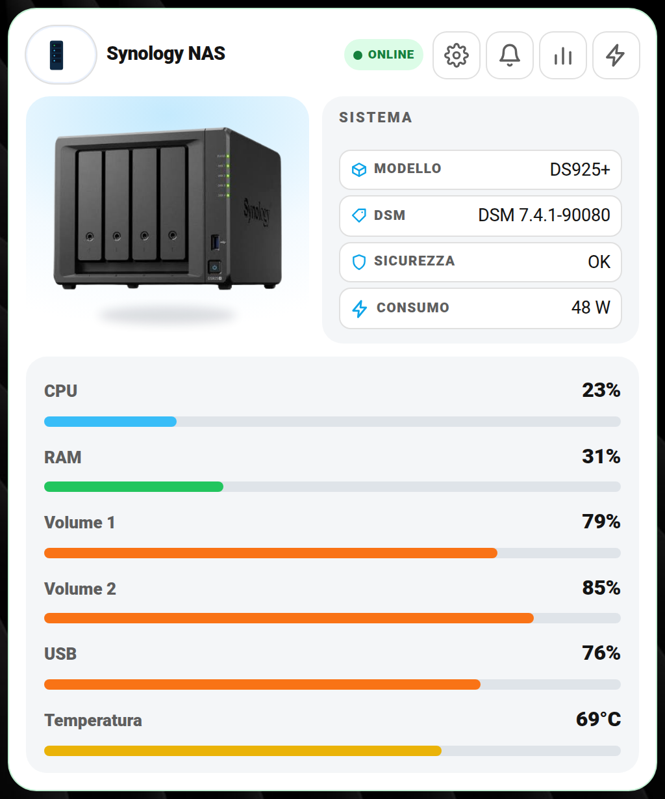 | 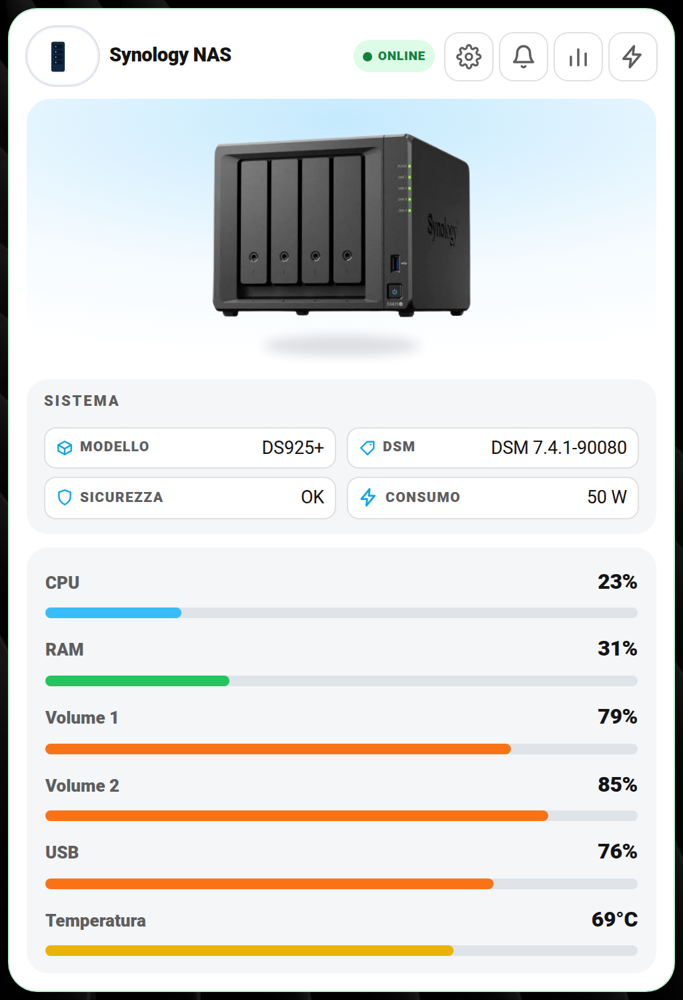 |

## 📈 Grafici

Il pulsante con la **linea che sale** apre il grafico storico in **24 h · 7 gg · 30 gg · da … a**. Il grafico mostra **CPU**, **RAM**, **volumi**, **USB** e **temperatura**. Vedi la guida completa: [Grafici](grafici.md).

| Chiaro | Scuro |
|---|---|
| 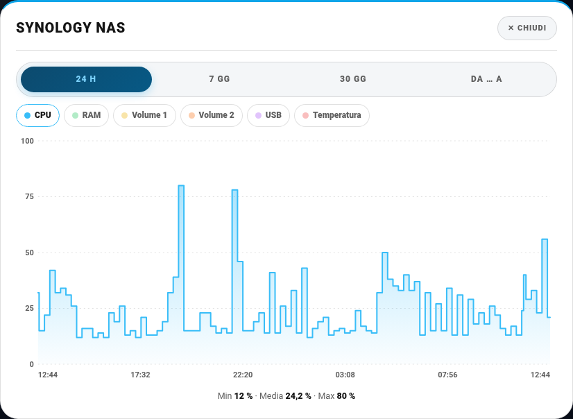 |  |

## 🖼️ Tutte le schermate

Tutti i popup della card, con i dati sensibili (indirizzi IP, nomi, ecc.) oscurati.

**Impostazioni (ingranaggio)**

| Chiaro | Scuro |
|---|---|
|  | 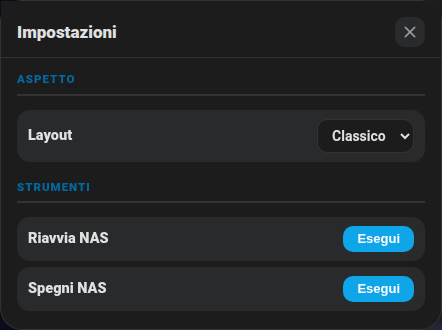 |

**Aggiornamenti (campanella)**

| Chiaro | Scuro |
|---|---|
| 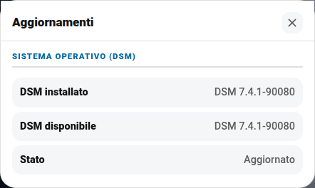 | 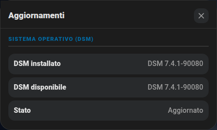 |

**Statistiche (barrette)**

| Chiaro | Scuro |
|---|---|
| 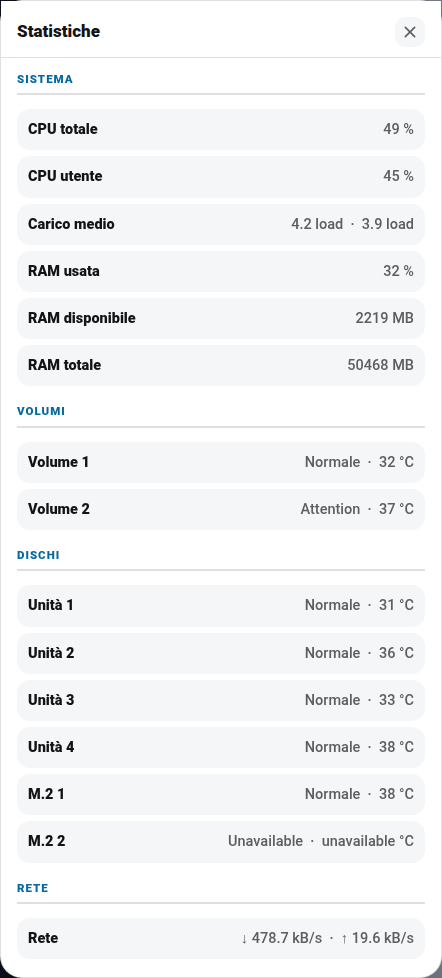 | 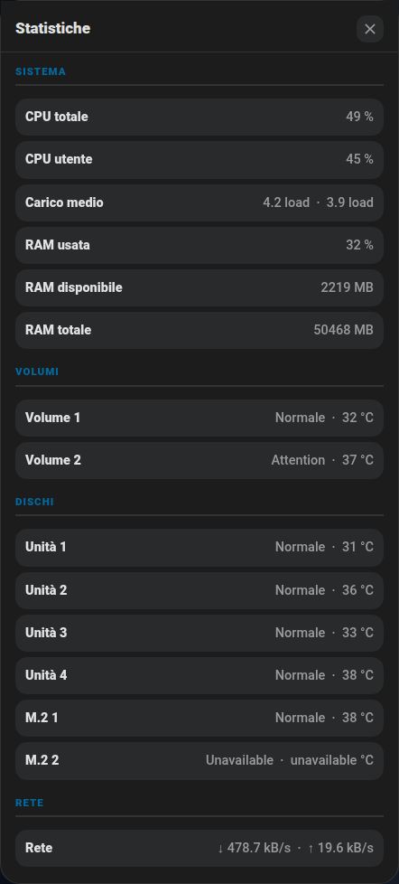 |

**Consumi (fulmine)**

| Chiaro | Scuro |
|---|---|
| 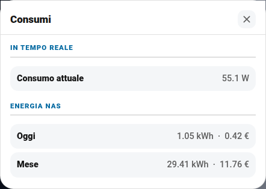 | 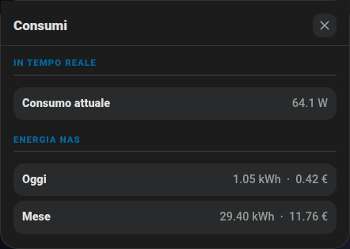 |
