# 🖧 Card Proxmox (`shc-proxmox-card`)

Stato del nodo Proxmox VE: CPU/RAM/disco, container e VM attive, consumo elettrico, salute SSD.

| Chiaro | Scuro |
|---|---|
| 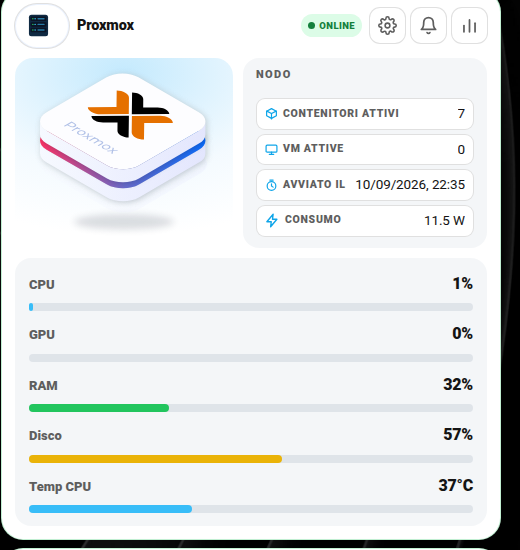 | 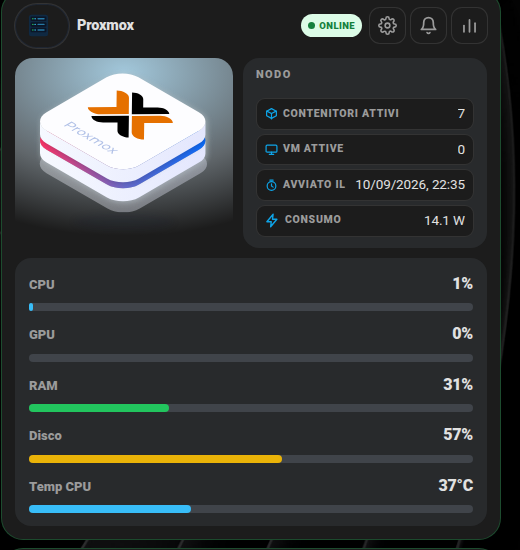 |

Nessun campo è tecnicamente obbligatorio (la card si carica comunque anche vuota), ma senza almeno `sensors.cpu`/`sensors.ram_pct` non mostra granché di utile.

## Cosa ti serve prima di iniziare

Un modo per portare in Home Assistant le statistiche del tuo host Proxmox VE — le due strade più comuni:
- L'integrazione core/HACS **Proxmox VE** (espone CPU/RAM/disco/numero di VM e container per nodo).
- In alternativa, un piccolo script/`command_line` sensor che interroga l'API di Proxmox (`https://<host>:8006/api2/json/...`) se preferisci non installare integrazioni extra.

## 🚀 Metodo veloce: usa i miei file originali

- [`packages/proxmox_ve.yaml`](../packages/proxmox_ve.yaml) — configurazione dell'integrazione Proxmox VE via YAML (utile perché, a differenza della UI, sopravvive ai riavvii senza perdere l'entry). Cambia `host` con l'IP del tuo Proxmox, `username`/`realm` con il tuo utente (io uso un utente dedicato di sola lettura, consigliato), e crea un `secrets.yaml` con `proxmox_ha_psw: la_tua_password`.
- [`packages/centro_controllo_proxmox.yaml`](../packages/centro_controllo_proxmox.yaml) — automazione di notifica se CPU/RAM superano il 90% per più di 2 minuti. Cambia `sensor.node_proxmox_cpu_usata`/`sensor.node_proxmox_percentuale_memoria_usata` con i TUOI sensori (i nomi dipendono da come hai chiamato il nodo), `notify.mobile_app_il_tuo_telefono` con il tuo, e se non usi Telegram cancella il blocco `telegram_bot.send_message` (o metti il tuo `chat_id`).

`cpu_temp` e `gpu_pct` **non** fanno parte delle statistiche standard di Proxmox: se vuoi mostrarli ti serve qualcosa che legga i sensori hardware dell'host (es. `lm-sensors` + un sensore `command_line`/SSH, oppure un agente tipo Glances/System Bridge installato sull'host). Se non ti interessano, ometti semplicemente questi due campi.

## 🖊️ Editor visuale (senza YAML)

Non serve scrivere configurazione a mano: "Aggiungi card" → cerca **"Proxmox"** → compila i campi, ogni entità si cerca per nome con anteprima. Lo stesso editor si apre anche per modificare una card già aggiunta (pulsante "⋮" sulla card in modalità modifica → "Edit").

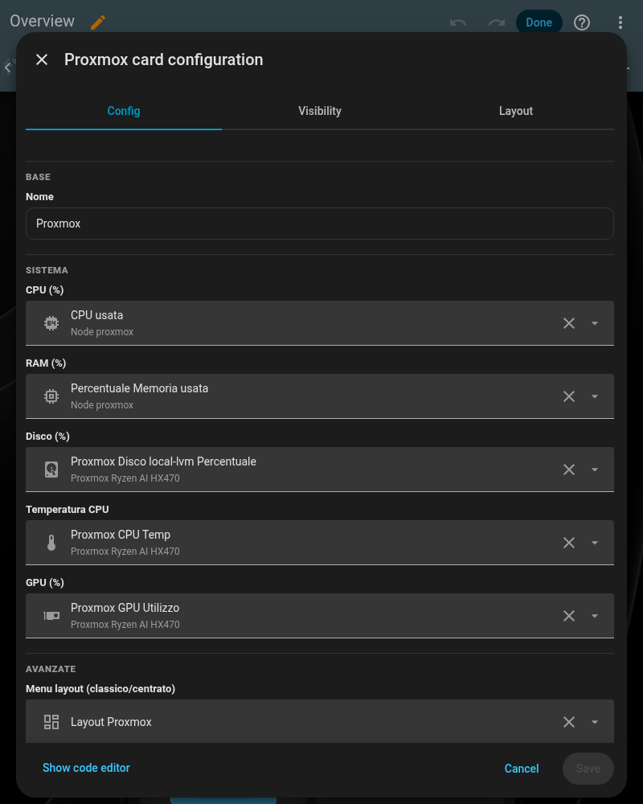

## Campo per campo

```yaml
type: custom:shc-proxmox-card
name: Proxmox
sensors:
  status: binary_sensor.proxmox_stato          # online/offline
  cpu: sensor.proxmox_cpu_usata                # %
  ram_pct: sensor.proxmox_memoria_percentuale  # %
  ram_used: sensor.proxmox_memoria_usata
  ram_free: sensor.proxmox_memoria_libera
  disk_pct: sensor.proxmox_disco_percentuale   # %
  containers: sensor.proxmox_contenitori_attivi
  vms: sensor.proxmox_macchine_virtuali_attive
  last_boot: sensor.proxmox_ultimo_avvio
  cpu_temp: sensor.proxmox_cpu_temperatura     # opzionale, vedi sopra
  gpu_pct: sensor.proxmox_gpu_utilizzo         # opzionale, vedi sopra
power:                                          # opzionale, serve una presa smart a monte - popup "Consumi" (fulmine)
  power: sensor.proxmox_power
  voltage: sensor.proxmox_voltage
  current: sensor.proxmox_current
  energy_day: sensor.proxmox_energia_oggi
  energy_month: sensor.proxmox_energia_mese
energy_stat_entity: sensor.proxmox_kwh_storico  # opzionale: sensore kWh con storico a lungo termine - aggiunge consumi per periodo + istogrammi mese/anno al popup "Consumi"
cost_entity: input_number.costo_energia         # opzionale, tariffa €/kWh per calcolare i costi insieme a energy_stat_entity
disk_health:                                    # opzionale, richiede SMART (es. via smartctl/scrutiny)
  temp: sensor.ssd_proxmox_temperatura
  wearout: sensor.ssd_proxmox_usura
  power_on_hours: sensor.ssd_proxmox_ore_avvio
  power_cycles: sensor.ssd_proxmox_cicli_alimentazione
  health: binary_sensor.ssd_proxmox_stato_salute
update: update.proxmox_ve_update                # opzionale, se hai un modo per rilevare update disponibili
actions:                                        # opzionale
  - label: Riavvia Host
    entity: script.proxmox_riavvia
    confirm: "Vuoi riavviare il server fisico?"
settings_sections: []                           # opzionale, vedi settings-sections.md
```

`disk_health` è pensato per un SSD/NVMe che espone dati SMART — se usi [Scrutiny](https://github.com/AnalogJ/scrutiny) o un semplice `command_line` sensor su `smartctl -a`, questi sono i valori tipici da estrarne. Anche questo blocco è del tutto opzionale.

Per il pattern notifiche vedi [notifiche-personalizzate.md](notifiche-personalizzate.md), per `settings_sections` vedi [settings-sections.md](settings-sections.md).

## 🎛️ Layout classico o centrato

Questa card si può mostrare con la foto a sinistra (**classico**) oppure con la foto al centro in alto (**centrato**). Si sceglie dalla prima riga **Layout** delle Impostazioni: vedi la guida [Layout delle card](layout.md) per attivarla (menu `input_select.layout_proxmox` e parametro `layout_entity`).

```yaml
layout_entity: input_select.layout_proxmox
settings_sections:
  - title: Aspetto
    rows:
      - { entity: input_select.layout_proxmox, label: Layout }
  # ...le altre sezioni
```

| Classico | Centrato |
|---|---|
| 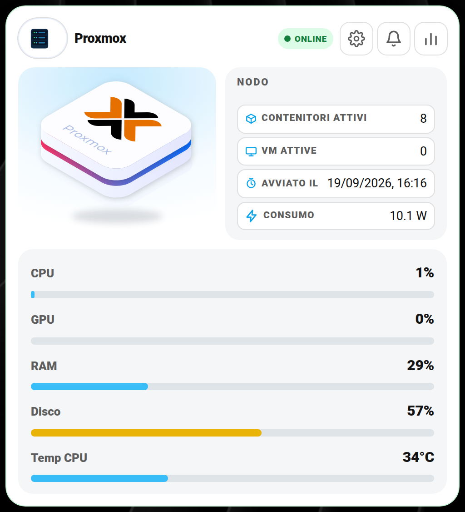 | 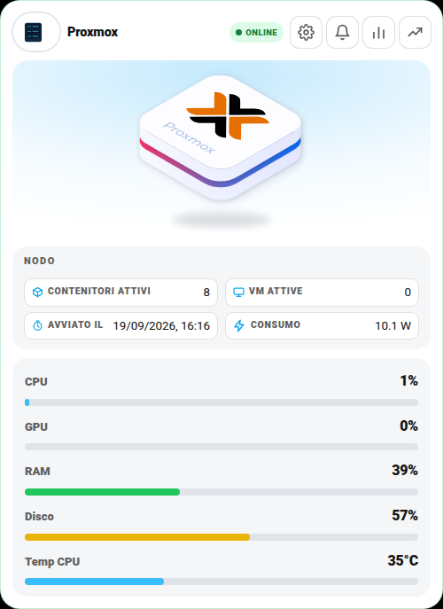 |

## 📈 Grafici

Il pulsante con la **linea che sale** apre il grafico storico in **24 h · 7 gg · 30 gg · da … a**. Il grafico mostra **CPU**, **RAM**, **disco**, **temperatura CPU** e **GPU**. Vedi la guida completa: [Grafici](grafici.md).

| Chiaro | Scuro |
|---|---|
| 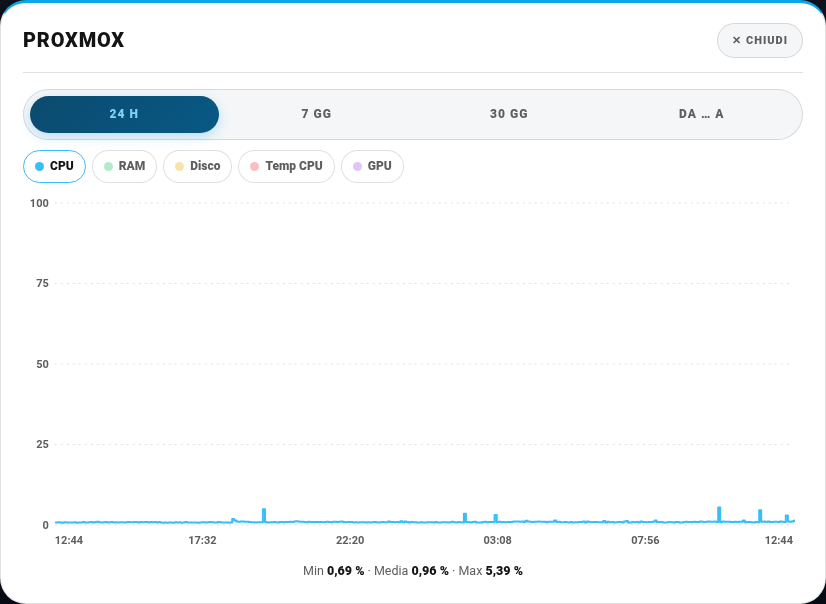 | 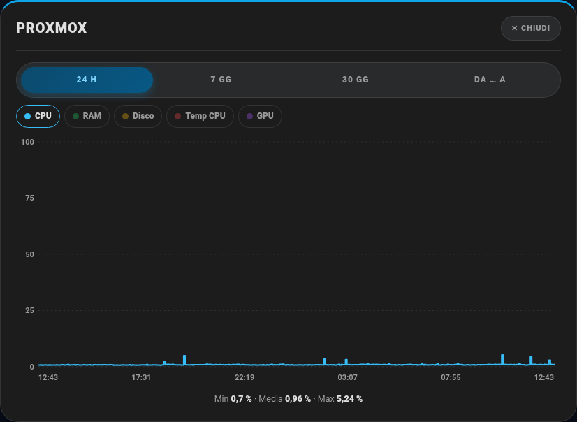 |

## 🖼️ Tutte le schermate

Tutti i popup della card, con i dati sensibili (indirizzi IP, nomi, ecc.) oscurati.

**Impostazioni (ingranaggio)**

| Chiaro | Scuro |
|---|---|
| 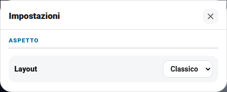 | 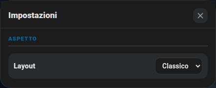 |

**Aggiornamenti (campanella)**

| Chiaro | Scuro |
|---|---|
| 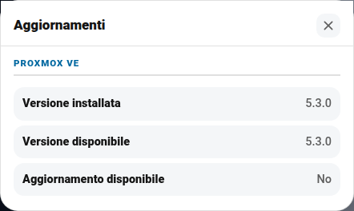 | 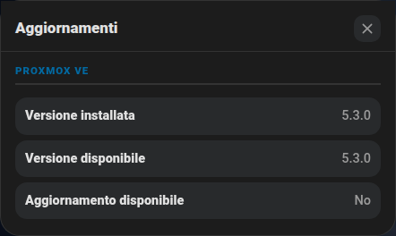 |

**Statistiche (barrette)**

| Chiaro | Scuro |
|---|---|
| 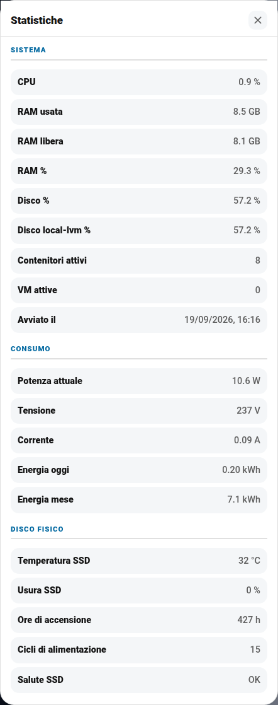 | 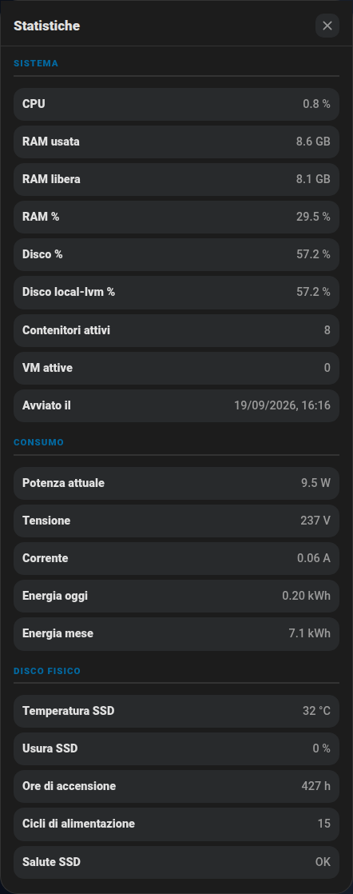 |

**Consumi (fulmine)** — potenza istantanea, tensione, corrente, energia oggi/mese; con `energy_stat_entity` anche i totali per periodo e gli istogrammi mese/anno (stesso pulsante, stesso contenuto della card NAS Synology)

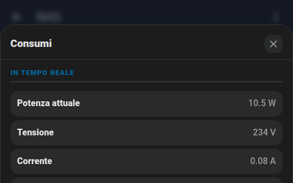
