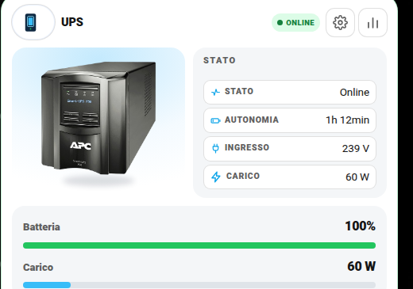
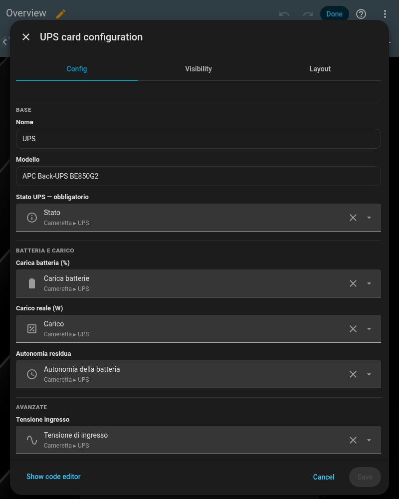
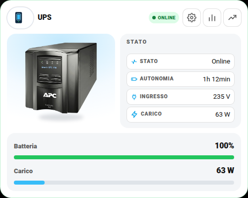
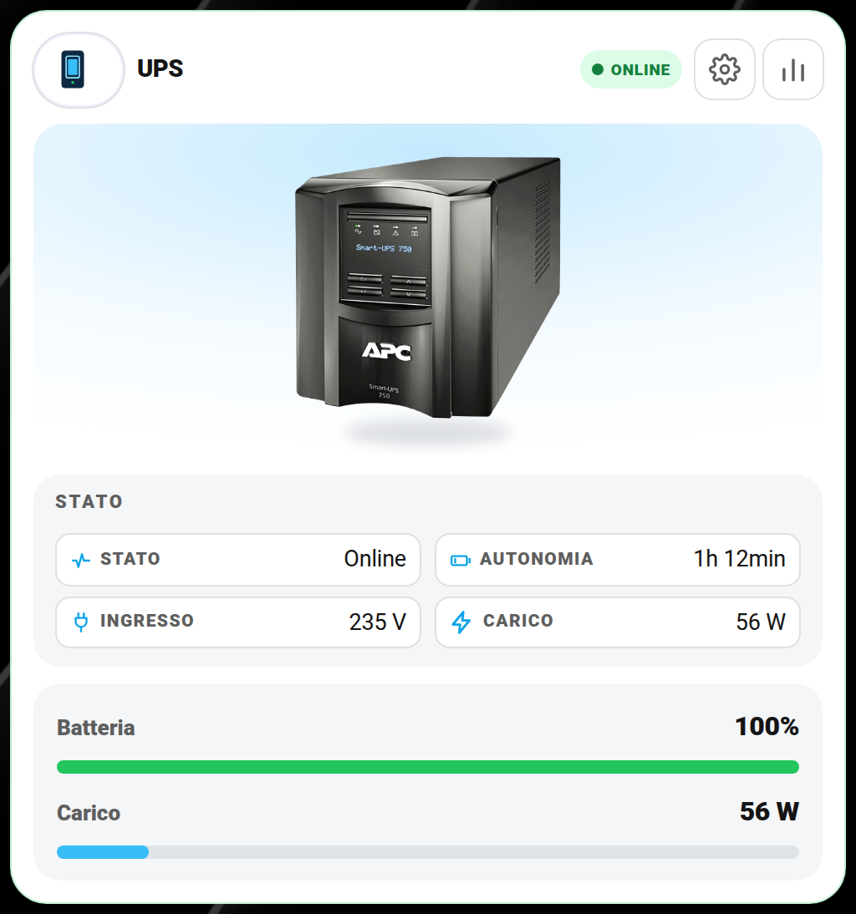
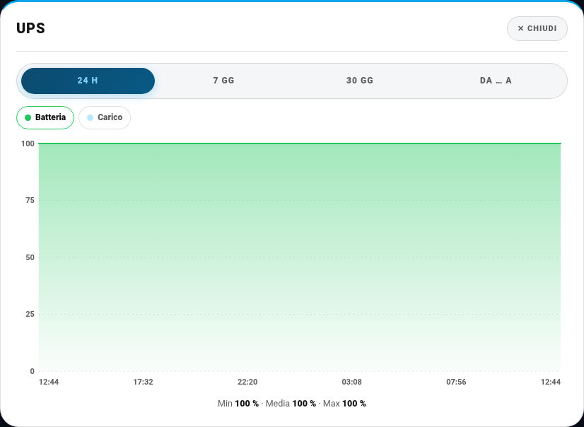
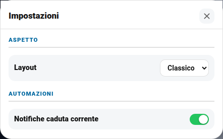
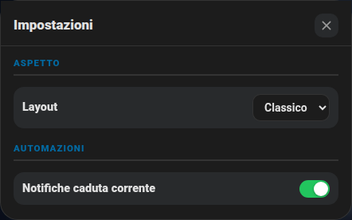
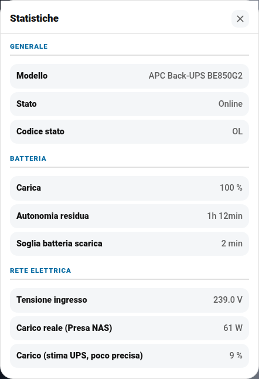
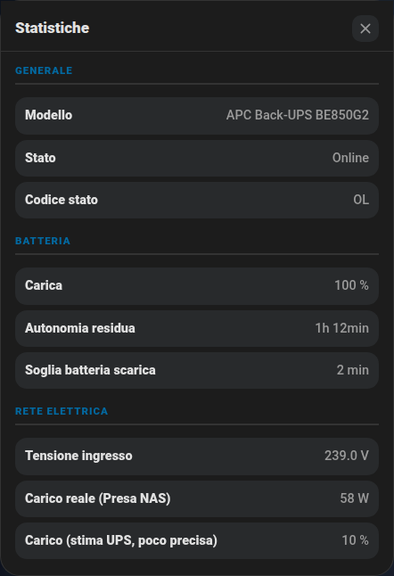

# 🔋 Card UPS (`shc-ups-card`)

Stato del gruppo di continuità: online/a batteria, percentuale di carica, carico attuale, autonomia residua. La card più semplice della raccolta — niente popup Impostazioni, va dritta al punto.

| Chiaro | Scuro |
|---|---|
|  |  |

## Cosa ti serve prima di iniziare

Un UPS collegato via USB/rete al tuo server, esposto in Home Assistant tramite l'integrazione **[NUT (Network UPS Tools)](https://www.home-assistant.io/integrations/nut/)** (supporta la maggior parte delle marche, incluso APC) — Impostazioni → Dispositivi e servizi → Aggiungi integrazione → cerca "NUT". Quell'integrazione crea automaticamente sensori di stato, carica, carico e autonomia: i nomi esatti dipendono dal modello, controllali in Impostazioni → Entità dopo averla configurata.

## 🚀 Metodo veloce: usa il mio package originale

Il package completo — notifiche di caduta/ritorno corrente (con coda differita se manca anche internet), spegnimento/ripristino automatico di alcune luci, manutenzione batteria — è in [`packages/centro_controllo_ups.yaml`](../packages/centro_controllo_ups.yaml). A differenza degli altri package non ha un blocco "impostazioni" unico in cima (è più vecchio), quindi qui sotto trovi l'elenco di cosa cercare e sostituire nel file (Ctrl+F):

| Cerca | Sostituisci con |
|---|---|
| `sensor.ups_stato`, `sensor.ups_carica_batterie`, `sensor.ups_autonomia_della_batteria`, `sensor.ups_tensione_di_ingresso` | i TUOI sensori creati dall'integrazione NUT |
| `sensor.fritzbox` | il TUO sensore di connettività/internet (per capire se manca anche la rete, non solo la corrente) |
| `light.striscia_cucina`, `light.striscia_armadio` | le TUE luci da spegnere/ripristinare al blackout (o cancella questa parte se non ti interessa) |
| `binary_sensor.presenza_salone_occupancy` | il TUO sensore di presenza, se vuoi la stessa logica "ripristina solo se c'è qualcuno" |
| `sensor.presa_nas_power`, `sensor.proxmox_power` | i TUOI sensori di potenza, se li hai (usati solo per un piccolo sensore "NAS Watt" di comodo) |
| `mobile_app_il_tuo_telefono` / `mobile_app_del_partner` | i TUOI `notify.mobile_app_xxx` |
| `chat_id: [111111111, 222222222]` | i TUOI ID chat Telegram (o cancella i blocchi `telegram_bot.send_message` se non lo usi) |

Copialo dentro `/config/packages/` (richiede i [Packages](https://www.home-assistant.io/docs/configuration/packages/) attivi), fai le sostituzioni, riavvia Home Assistant.

## Configurazione minima

```yaml
type: custom:shc-ups-card
name: UPS
status_entity: sensor.ups_status    # unico campo obbligatorio: stato testuale (Online, On Battery, ecc.)
```

## 🖊️ Editor visuale (senza YAML)

Non serve scrivere configurazione a mano: "Aggiungi card" → cerca **"UPS"** → compila i campi, ogni entità si cerca per nome con anteprima. Lo stesso editor si apre anche per modificare una card già aggiunta (pulsante "⋮" sulla card in modalità modifica → "Edit").



## Campo per campo

| Campo | Obbligatorio | Default | Descrizione |
|---|---|---|---|
| `status_entity` | **Sì** | — | Stato testuale dell'UPS (es. "Online", "On Battery") |
| `name` | No | `"UPS"` | Titolo card |
| `model` | No | — | Testo libero, es. `"APC Back-UPS BE850G2"` |
| `rated_watts` | No | `450` | Potenza nominale dell'UPS, usata come fondo scala della barra di carico |
| `status_code_entity` | No | — | Codice di stato grezzo, se la tua integrazione lo espone separatamente dal testo |
| `battery_entity` | No | — | `sensor` percentuale di carica batteria |
| `load_entity` | No | — | `sensor` percentuale di carico attuale |
| `runtime_entity` | No | — | `sensor` autonomia residua stimata (minuti) |
| `runtime_low_entity` | No | — | Soglia di autonomia minima configurata sull'UPS stesso, se esposta |
| `input_voltage_entity` | No | — | `sensor` tensione di rete in ingresso |
| `power_entity` | No | — | `sensor` in Watt, se hai anche una presa smart che misura il consumo reale collegato all'UPS (più preciso della sola percentuale di carico) |
| `automation_entity` | No | — | Un'automazione che gestisci tu (es. "spegni i servizi non critici sotto il 20% di batteria") — mostrata come riga informativa/attivabile |
| `actions` | No | `[]` | Pulsanti extra con conferma, stesso formato delle altre card — vedi [fritzbox.md](fritzbox.md#actions--pulsanti-con-conferma) per un esempio |
| `settings_sections` | No | `[]` | Vedi [settings-sections.md](settings-sections.md) |

## Esempio completo

```yaml
type: custom:shc-ups-card
name: UPS
model: "APC Back-UPS BE850G2"
status_entity: sensor.ups_status
battery_entity: sensor.ups_battery_charge
load_entity: sensor.ups_load
runtime_entity: sensor.ups_battery_runtime
input_voltage_entity: sensor.ups_input_voltage
rated_watts: 450
```

## 🎛️ Layout classico o centrato

Questa card si può mostrare con la foto a sinistra (**classico**) oppure con la foto al centro in alto (**centrato**). Si sceglie dalla prima riga **Layout** delle Impostazioni: vedi la guida [Layout delle card](layout.md) per attivarla (menu `input_select.layout_ups` e parametro `layout_entity`).

```yaml
layout_entity: input_select.layout_ups
settings_sections:
  - title: Aspetto
    rows:
      - { entity: input_select.layout_ups, label: Layout }
  # ...le altre sezioni
```

| Classico | Centrato |
|---|---|
|  |  |

## 📈 Grafici

Il pulsante con la **linea che sale** apre il grafico storico in **24 h · 7 gg · 30 gg · da … a**. Il grafico mostra **batteria** e **carico**. Vedi la guida completa: [Grafici](grafici.md).

| Chiaro | Scuro |
|---|---|
|  |  |

## 🖼️ Tutte le schermate

Tutti i popup della card, con i dati sensibili (indirizzi IP, nomi, ecc.) oscurati.

**Impostazioni (ingranaggio)**

| Chiaro | Scuro |
|---|---|
|  |  |

**Statistiche (barrette)**

| Chiaro | Scuro |
|---|---|
|  |  |
